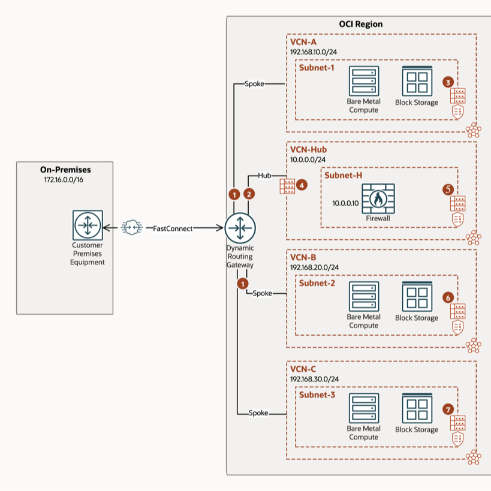

<!-- BEGIN_TF_DOCS -->
# Transit routing with a DRG hub and a network virtual appliance in an attached VCN 

## Description

This is an example for a "***Transit routing with a DRG hub and a network virtual appliance in an attached VCN***" instantiation of the ```terraform-oci-cis-landing-zone-networking``` networking core module.

For detailed description of the ```terraform-oci-cis-landing-zone-networking``` networking core module please refer to the core module specific [README.md](../../README.md) and [SPEC.md](../../SPEC.md).

This example shows a DRG acting as a hub and an attached VCN with a firewall.

For a complete example documentation please access this [OCI Documentation link](https://docs.public.oneportal.content.oci.oraclecloud.com/en-us/iaas/Content/Network/Tasks/scenario_g.htm#scenario_g__onramp_example).

## Diagram of the provisioned networking topology



## Instantiation

For clarity and proper separation and isolation we've separated the input parameters into 2 files by leveraging terraform ```*.auto.tfvars``` feature:

- [terraform.tfvars](./terraform.tfvars.template)


- [network_configuration.auto.tfvars](./network_configuration.auto.tfvars)

### Using the Module with ORM**

For an ad-hoc use where you can select your resources, follow these guidelines:
1. [](https://cloud.oracle.com/resourcemanager/stacks/create?zipUrl=https://github.com/oracle-quickstart/terraform-oci-cis-landing-zone-networking/archive/refs/heads/main.zip&zipUrlVariables={"input_config_file_url":"https://raw.githubusercontent.com/oracle-quickstart/terraform-oci-cis-landing-zone-networking/main/examples/simple-example/input-configs-standards-options/network_configuration.tfvars.json"})
2. Accept terms,  wait for the configuration to load. 
3. Set the working directory to “orm-facade”. 
4. Set the stack name you prefer.
5. Set the terraform version to 1.2.x. Click Next. 
6. Add your json/yaml configuration files. Click Next.
8. Un-check run apply. Click Create.


## Output Example:

```
provisioned_networking_resources = {
  "dhcp_options" = {}
  "drg_attachments" = {}
  "drg_route_distributions" = {}
  "drg_route_distributions_statements" = {}
  "drg_route_tables" = {}
  "dynamic_routing_gateways" = {}
  "internet_gateways" = {
    "IGW-KEY" = {
      "compartment_id" = "ocid1.compartment.oc1.. ..."
      "defined_tags" = tomap({
        "CCA_Basic_Tag.email" = "oracleidentitycloudservice/..."
      })
      "display_name" = "igw-prod-vcn"
      "enabled" = true
      "freeform_tags" = tomap({
        "vision-environment" = "vision"
        "vision-sub-environment" = "prod"
      })
      "id" = "ocid1.internetgateway.oc1. ..."
      "igw_key" = "IGW-KEY"
      "network_configuration_category" = "production"
      "route_table_id" = tostring(null)
      "route_table_key" = tostring(null)
      "route_table_name" = null
      "state" = "AVAILABLE"
      "time_created" = "2023-03-20 19:16:14.137 +0000 UTC"
      "timeouts" = null /* object */
      "vcn_id" = "ocid1.vcn.oc1. ..."
      "vcn_key" = "SIMPLE-VCN-KEY"
      "vcn_name" = "vcn-simple"
    }
  }
  "local_peering_gateways" = {}
  "nat_gateways" = {
    "NATGW-KEY" = {
      "block_traffic" = false
      "compartment_id" = "ocid1.compartment.oc1. ..."
      "defined_tags" = tomap({
        "CCA_Basic_Tag.email" = "oracleidentitycloudservice/..."
      })
      "display_name" = "natgw-prod-vcn"
      "freeform_tags" = tomap({
        "vision-environment" = "vision"
        "vision-sub-environment" = "prod"
      })
      "id" = "ocid1.natgateway.oc1. ..."
      "nat_ip" = "141.147.54.164"
      "natgw_key" = "NATGW-KEY"
      "network_configuration_category" = "production"
      "public_ip_id" = "ocid1.publicip.oc1. ..."
      "route_table_id" = tostring(null)
      "route_table_key" = tostring(null)
      "route_table_name" = null
      "state" = "AVAILABLE"
      "time_created" = "2023-03-20 19:16:14.087 +0000 UTC"
      "timeouts" = null /* object */
      "vcn_id" = "ocid1.vcn.oc1.eu-frankfurt-1. ..."
      "vcn_key" = "SIMPLE-VCN-KEY"
      "vcn_name" = "vcn-simple"
    }
  }
  "network_security_groups" = {
    "NSG-APP-KEY" = {
      "compartment_id" = "ocid1.compartment.oc1. ..."
      "defined_tags" = tomap({
        "CCA_Basic_Tag.email" = "oracleidentitycloudservice/..."
      })
      "display_name" = "nsg-app"
      "freeform_tags" = tomap({
        "vision-environment" = "vision"
        "vision-sub-environment" = "prod"
      })
      "id" = "ocid1.networksecuritygroup.oc1. ..."
      "network_configuration_category" = "production"
      "nsg_key" = "NSG-APP-KEY"
      "state" = "AVAILABLE"
      "time_created" = "2023-03-20 19:16:15.024 +0000 UTC"
      "timeouts" = null /* object */
      "vcn_id" = "ocid1.vcn.oc1.eu-frankfurt-1. ..."
      "vcn_key" = "SIMPLE-VCN-KEY"
      "vcn_name" = "vcn-simple"
    }
    "NSG-DB-KEY" = {
      "compartment_id" = "ocid1.compartment.oc1. ..."
      "defined_tags" = tomap({
        "CCA_Basic_Tag.email" = "oracleidentitycloudservice/..."
      })
      "display_name" = "nsg-db"
      "freeform_tags" = tomap({
        "vision-environment" = "vision"
        "vision-sub-environment" = "prod"
      })
      "id" = "ocid1.networksecuritygroup.oc1. ..."
      "network_configuration_category" = "production"
      "nsg_key" = "NSG-DB-KEY"
      "state" = "AVAILABLE"
      "time_created" = "2023-03-20 19:16:14.219 +0000 UTC"
      "timeouts" = null /* object */
      "vcn_id" = "ocid1.vcn.oc1.eu-frankfurt-1. ..."
      "vcn_key" = "SIMPLE-VCN-KEY"
      "vcn_name" = "vcn-simple"
    }
    "NSG-LB-KEY" = {
      "compartment_id" = "ocid1.compartment.oc1.. ..."
      "defined_tags" = tomap({
        "CCA_Basic_Tag.email" = "oracleidentitycloudservice/..."
      })
      "display_name" = "nsg-lb"
      "freeform_tags" = tomap({
        "vision-environment" = "vision"
        "vision-sub-environment" = "prod"
      })
      "id" = "ocid1.networksecuritygroup.oc1. ..."
      "network_configuration_category" = "production"
      "nsg_key" = "NSG-LB-KEY"
      "state" = "AVAILABLE"
      "time_created" = "2023-03-20 19:16:15.204 +0000 UTC"
      "timeouts" = null /* object */
      "vcn_id" = "ocid1.vcn.oc1. ..."
      "vcn_key" = "SIMPLE-VCN-KEY"
      "vcn_name" = "vcn-simple"
    }
  }
  "network_security_groups_egress_rules" = {
    "NSG-APP-KEY.anywhere" = {
      "description" = "egress to 0.0.0.0/0 over TCP"
      "destination" = "0.0.0.0/0"
      "destination_type" = "CIDR_BLOCK"
      "direction" = "EGRESS"
      "icmp_options" = tolist([])
      "id" = "50E4A3"
      "is_valid" = true
      "network_configuration_category" = "production"
      "network_security_group_id" = "ocid1.networksecuritygroup.oc1. ..."
      "network_security_group_key" = "NSG-APP-KEY"
      "network_security_group_name" = "nsg-app"
      "protocol" = "6"
      "source" = tostring(null)
      "source_type" = ""
      "stateless" = false
      "tcp_options" = tolist([
        {
          "destination_port_range" = tolist([])
          "source_port_range" = tolist([])
        },
      ])
      "time_created" = "2023-03-20 19:16:15.936 +0000 UTC"
      "timeouts" = null /* object */
      "udp_options" = tolist([])
      "vcn_key" = "SIMPLE-VCN-KEY"
      "vcn_name" = "vcn-simple"
    }
    "NSG-DB-KEY.anywhere" = {
      "description" = "egress to 0.0.0.0/0 over TCP"
      "destination" = "0.0.0.0/0"
      "destination_type" = "CIDR_BLOCK"
      "direction" = "EGRESS"
      "icmp_options" = tolist([])
      "id" = "EB5517"
      "is_valid" = true
      "network_configuration_category" = "production"
      "network_security_group_id" = "ocid1.networksecuritygroup.oc1. ..."
      "network_security_group_key" = "NSG-DB-KEY"
      "network_security_group_name" = "nsg-db"
      "protocol" = "6"
      "source" = tostring(null)
      "source_type" = ""
      "stateless" = false
      "tcp_options" = tolist([
        {
          "destination_port_range" = tolist([])
          "source_port_range" = tolist([])
        },
      ])
      "time_created" = "2023-03-20 19:16:16.138 +0000 UTC"
      "timeouts" = null /* object */
      "udp_options" = tolist([])
      "vcn_key" = "SIMPLE-VCN-KEY"
      "vcn_name" = "vcn-simple"
    }
    "NSG-LB-KEY.anywhere" = {
      "description" = "egress to 0.0.0.0/0 over TCP"
      "destination" = "0.0.0.0/0"
      "destination_type" = "CIDR_BLOCK"
      "direction" = "EGRESS"
      "icmp_options" = tolist([])
      "id" = "6EB4E7"
      "is_valid" = true
      "network_configuration_category" = "production"
      "network_security_group_id" = "ocid1.networksecuritygroup.oc1. ..."
      "network_security_group_key" = "NSG-LB-KEY"
      "network_security_group_name" = "nsg-lb"
      "protocol" = "6"
      "source" = tostring(null)
      "source_type" = ""
      "stateless" = false
      "tcp_options" = tolist([
        {
          "destination_port_range" = tolist([])
          "source_port_range" = tolist([])
        },
      ])
      "time_created" = "2023-03-20 19:16:16.511 +0000 UTC"
      "timeouts" = null /* object */
      "udp_options" = tolist([])
      "vcn_key" = "SIMPLE-VCN-KEY"
      "vcn_name" = "vcn-simple"
    }
  }
  "network_security_groups_ingress_rules" = {
    "NSG-APP-KEY.http_8080" = {
      "description" = "ingress from 0.0.0.0/0 over HTTP8080"
      "destination" = tostring(null)
      "destination_type" = ""
      "direction" = "INGRESS"
      "icmp_options" = tolist([])
      "id" = "4FA4CA"
      "is_valid" = true
      "network_configuration_category" = "production"
      "network_security_group_id" = "ocid1.networksecuritygroup.oc1. ..."
      "network_security_group_key" = "NSG-APP-KEY"
      "network_security_group_name" = "nsg-app"
      "protocol" = "6"
      "source" = "ocid1.networksecuritygroup.oc1. ..."
      "source_type" = "NETWORK_SECURITY_GROUP"
      "stateless" = false
      "tcp_options" = tolist([
        {
          "destination_port_range" = tolist([
            {
              "max" = 80
              "min" = 80
            },
          ])
          "source_port_range" = tolist([])
        },
      ])
      "time_created" = "2023-03-20 19:16:16.207 +0000 UTC"
      "timeouts" = null /* object */
      "udp_options" = tolist([])
      "vcn_key" = "SIMPLE-VCN-KEY"
      "vcn_name" = "vcn-simple"
    }
    "NSG-APP-KEY.ssh_22" = {
      "description" = "ingress from 0.0.0.0/0 over TCP22"
      "destination" = tostring(null)
      "destination_type" = ""
      "direction" = "INGRESS"
      "icmp_options" = tolist([])
      "id" = "1E6283"
      "is_valid" = true
      "network_configuration_category" = "production"
      "network_security_group_id" = "ocid1.networksecuritygroup.oc1. ..."
      "network_security_group_key" = "NSG-APP-KEY"
      "network_security_group_name" = "nsg-app"
      "protocol" = "6"
      "source" = "ocid1.networksecuritygroup.oc1. ..."
      "source_type" = "NETWORK_SECURITY_GROUP"
      "stateless" = false
      "tcp_options" = tolist([
        {
          "destination_port_range" = tolist([
            {
              "max" = 22
              "min" = 22
            },
          ])
          "source_port_range" = tolist([])
        },
      ])
      "time_created" = "2023-03-20 19:16:16.847 +0000 UTC"
      "timeouts" = null /* object */
      "udp_options" = tolist([])
      "vcn_key" = "SIMPLE-VCN-KEY"
      "vcn_name" = "vcn-simple"
    }
    "NSG-DB-KEY.http_8080" = {
      "description" = "ingress from 0.0.0.0/0 over TCP:1521"
      "destination" = tostring(null)
      "destination_type" = ""
      "direction" = "INGRESS"
      "icmp_options" = tolist([])
      "id" = "4EE58E"
      "is_valid" = true
      "network_configuration_category" = "production"
      "network_security_group_id" = "ocid1.networksecuritygroup.oc1. ..."
      "network_security_group_key" = "NSG-DB-KEY"
      "network_security_group_name" = "nsg-db"
      "protocol" = "6"
      "source" = "ocid1.networksecuritygroup.oc1. ..."
      "source_type" = "NETWORK_SECURITY_GROUP"
      "stateless" = false
      "tcp_options" = tolist([
        {
          "destination_port_range" = tolist([
            {
              "max" = 1521
              "min" = 1521
            },
          ])
          "source_port_range" = tolist([])
        },
      ])
      "time_created" = "2023-03-20 19:16:16.323 +0000 UTC"
      "timeouts" = null /* object */
      "udp_options" = tolist([])
      "vcn_key" = "SIMPLE-VCN-KEY"
      "vcn_name" = "vcn-simple"
    }
    "NSG-DB-KEY.ssh_22" = {
      "description" = "ingress from 0.0.0.0/0 over TCP22"
      "destination" = tostring(null)
      "destination_type" = ""
      "direction" = "INGRESS"
      "icmp_options" = tolist([])
      "id" = "CF0474"
      "is_valid" = true
      "network_configuration_category" = "production"
      "network_security_group_id" = "ocid1.networksecuritygroup.oc1. ..."
      "network_security_group_key" = "NSG-DB-KEY"
      "network_security_group_name" = "nsg-db"
      "protocol" = "6"
      "source" = "ocid1.networksecuritygroup.oc1. ..."
      "source_type" = "NETWORK_SECURITY_GROUP"
      "stateless" = false
      "tcp_options" = tolist([
        {
          "destination_port_range" = tolist([
            {
              "max" = 22
              "min" = 22
            },
          ])
          "source_port_range" = tolist([])
        },
      ])
      "time_created" = "2023-03-20 19:16:16.589 +0000 UTC"
      "timeouts" = null /* object */
      "udp_options" = tolist([])
      "vcn_key" = "SIMPLE-VCN-KEY"
      "vcn_name" = "vcn-simple"
    }
    "NSG-LB-KEY.http_443" = {
      "description" = "ingress from 0.0.0.0/0 over https:443"
      "destination" = tostring(null)
      "destination_type" = ""
      "direction" = "INGRESS"
      "icmp_options" = tolist([])
      "id" = "0BC623"
      "is_valid" = true
      "network_configuration_category" = "production"
      "network_security_group_id" = "ocid1.networksecuritygroup.oc1. ..."
      "network_security_group_key" = "NSG-LB-KEY"
      "network_security_group_name" = "nsg-lb"
      "protocol" = "6"
      "source" = "0.0.0.0/0"
      "source_type" = "CIDR_BLOCK"
      "stateless" = false
      "tcp_options" = tolist([
        {
          "destination_port_range" = tolist([
            {
              "max" = 443
              "min" = 443
            },
          ])
          "source_port_range" = tolist([])
        },
      ])
      "time_created" = "2023-03-20 19:16:16.165 +0000 UTC"
      "timeouts" = null /* object */
      "udp_options" = tolist([])
      "vcn_key" = "SIMPLE-VCN-KEY"
      "vcn_name" = "vcn-simple"
    }
    "NSG-LB-KEY.ssh_22" = {
      "description" = "ingress from 0.0.0.0/0 over TCP22"
      "destination" = tostring(null)
      "destination_type" = ""
      "direction" = "INGRESS"
      "icmp_options" = tolist([])
      "id" = "B3BD8C"
      "is_valid" = true
      "network_configuration_category" = "production"
      "network_security_group_id" = "ocid1.networksecuritygroup.oc1. ..."
      "network_security_group_key" = "NSG-LB-KEY"
      "network_security_group_name" = "nsg-lb"
      "protocol" = "6"
      "source" = "0.0.0.0/0"
      "source_type" = "CIDR_BLOCK"
      "stateless" = false
      "tcp_options" = tolist([
        {
          "destination_port_range" = tolist([
            {
              "max" = 22
              "min" = 22
            },
          ])
          "source_port_range" = tolist([])
        },
      ])
      "time_created" = "2023-03-20 19:16:16.341 +0000 UTC"
      "timeouts" = null /* object */
      "udp_options" = tolist([])
      "vcn_key" = "SIMPLE-VCN-KEY"
      "vcn_name" = "vcn-simple"
    }
  }
  "oci_network_firewall_network_firewall_policies" = {}
  "oci_network_firewall_network_firewalls" = {}
  "remote_peering_connections" = {}
  "route_tables" = {
    "RT-01-KEY" = {
      "compartment_id" = "ocid1.compartment.oc1. ..."
      "defined_tags" = tomap({
        "CCA_Basic_Tag.email" = "oracleidentitycloudservice/..."
      })
      "display_name" = "rt-01"
      "freeform_tags" = tomap({
        "vision-environment" = "vision"
        "vision-sub-environment" = "prod"
      })
      "id" = "ocid1.routetable.oc1. ..."
      "network_configuration_category" = "production"
      "route_rules" = toset([
        {
          "cidr_block" = ""
          "description" = "Route for internet access"
          "destination" = "0.0.0.0/0"
          "destination_type" = "CIDR_BLOCK"
          "network_entity_id" = "ocid1.internetgateway.oc1. ..."
          "route_type" = ""
        },
      ])
      "route_table_key" = "RT-01-KEY"
      "state" = "AVAILABLE"
      "time_created" = "2023-03-20 19:16:15.629 +0000 UTC"
      "timeouts" = null /* object */
      "vcn_id" = "ocid1.vcn.oc1. ..."
      "vcn_key" = "SIMPLE-VCN-KEY"
      "vcn_name" = "vcn-simple"
    }
    "RT-02-KEY" = {
      "compartment_id" = "ocid1.compartment.oc1. ..."
      "defined_tags" = tomap({
        "CCA_Basic_Tag.email" = "oracleidentitycloudservice/..."
      })
      "display_name" = "rt-02-prod-vcn-01"
      "freeform_tags" = tomap({
        "vision-environment" = "vision"
        "vision-sub-environment" = "prod"
      })
      "id" = "ocid1.routetable.oc1. ..."
      "network_configuration_category" = "production"
      "route_rules" = toset([
        {
          "cidr_block" = ""
          "description" = "Route for internet access via NAT GW"
          "destination" = "0.0.0.0/0"
          "destination_type" = "CIDR_BLOCK"
          "network_entity_id" = "ocid1.natgateway.oc1. ..."
          "route_type" = ""
        },
        {
          "cidr_block" = ""
          "description" = "Route for sgw"
          "destination" = "oci-fra-objectstorage"
          "destination_type" = "SERVICE_CIDR_BLOCK"
          "network_entity_id" = "ocid1.servicegateway.oc1. ..."
          "route_type" = ""
        },
      ])
      "route_table_key" = "RT-02-KEY"
      "state" = "AVAILABLE"
      "time_created" = "2023-03-20 19:16:16.012 +0000 UTC"
      "timeouts" = null /* object */
      "vcn_id" = "ocid1.vcn.oc1. ..."
      "vcn_key" = "SIMPLE-VCN-KEY"
      "vcn_name" = "vcn-simple"
    }
  }
  "route_tables_attachments" = {
    "PRIVATE-APP-SUBNET-KEY" = {
      "id" = "ocid1.subnet.oc1. ..."
      "network_configuration_category" = "production"
      "route_table_id" = "ocid1.routetable.oc1. ..."
      "route_table_key" = "RT-02-KEY"
      "route_table_name" = "rt-02-prod-vcn-01"
      "rta_key" = "PRIVATE-APP-SUBNET-KEY"
      "subnet_id" = "ocid1.subnet.oc1. ..."
      "subnet_key" = "PRIVATE-APP-SUBNET-KEY"
      "subnet_name" = "sub-private-app"
      "timeouts" = null /* object */
      "vcn_key" = "SIMPLE-VCN-KEY"
      "vcn_name" = "vcn-simple"
    }
    "PRIVATE_DB_SUBNET_KEY" = {
      "id" = "ocid1.subnet.oc1. ..."
      "network_configuration_category" = "production"
      "route_table_id" = "ocid1.routetable.oc1. ..."
      "route_table_key" = "RT-02-KEY"
      "route_table_name" = "rt-02-prod-vcn-01"
      "rta_key" = "PRIVATE_DB_SUBNET_KEY"
      "subnet_id" = "ocid1.subnet.oc1. ..."
      "subnet_key" = "PRIVATE_DB_SUBNET_KEY"
      "subnet_name" = "sub-private-db"
      "timeouts" = null /* object */
      "vcn_key" = "SIMPLE-VCN-KEY"
      "vcn_name" = "vcn-simple"
    }
    "PUBLIC-LB-SUBNET-KEY" = {
      "id" = "ocid1.subnet.oc1. ..."
      "network_configuration_category" = "production"
      "route_table_id" = "ocid1.routetable.oc1. ..."
      "route_table_key" = "RT-01-KEY"
      "route_table_name" = "rt-01"
      "rta_key" = "PUBLIC-LB-SUBNET-KEY"
      "subnet_id" = "ocid1.subnet.oc1. ..."
      "subnet_key" = "PUBLIC-LB-SUBNET-KEY"
      "subnet_name" = "sub-public-lb"
      "timeouts" = null /* object */
      "vcn_key" = "SIMPLE-VCN-KEY"
      "vcn_name" = "vcn-simple"
    }
  }
  "security_lists" = {
    "SECLIST-APP-KEY" = {
      "compartment_id" = "ocid1.compartment.oc1. ..."
      "defined_tags" = tomap({
        "CCA_Basic_Tag.email" = "oracleidentitycloudservice/..."
      })
      "display_name" = "sl-app"
      "egress_security_rules" = toset([
        {
          "description" = "egress to 0.0.0.0/0 over TCP"
          "destination" = "0.0.0.0/0"
          "destination_type" = "CIDR_BLOCK"
          "icmp_options" = tolist([])
          "protocol" = "6"
          "stateless" = false
          "tcp_options" = tolist([])
          "udp_options" = tolist([])
        },
      ])
      "freeform_tags" = tomap({
        "vision-environment" = "vision"
        "vision-sub-environment" = "prod"
      })
      "id" = "ocid1.securitylist.oc1.eu-frankfurt-1. ..."
      "ingress_security_rules" = toset([
        {
          "description" = "ingress from 10.0.3.0/24 over HTTP80"
          "icmp_options" = tolist([])
          "protocol" = "6"
          "source" = "10.0.3.0/24"
          "source_type" = "CIDR_BLOCK"
          "stateless" = false
          "tcp_options" = tolist([
            {
              "max" = 80
              "min" = 80
              "source_port_range" = tolist([])
            },
          ])
          "udp_options" = tolist([])
        },
        {
          "description" = "ingress from 10.0.3.0/24 over TCP22"
          "icmp_options" = tolist([])
          "protocol" = "6"
          "source" = "10.0.3.0/24"
          "source_type" = "CIDR_BLOCK"
          "stateless" = false
          "tcp_options" = tolist([])
          "udp_options" = tolist([])
        },
      ])
      "network_configuration_category" = "production"
      "sec_list_key" = "SECLIST-APP-KEY"
      "state" = "AVAILABLE"
      "time_created" = "2023-03-20 19:16:14.161 +0000 UTC"
      "timeouts" = null /* object */
      "vcn_id" = "ocid1.vcn.oc1.eu-frankfurt-1. ..."
      "vcn_key" = "SIMPLE-VCN-KEY"
      "vcn_name" = "vcn-simple"
    }
    "SECLIST-DB-KEY" = {
      "compartment_id" = "ocid1.compartment.oc1. ..."
      "defined_tags" = tomap({
        "CCA_Basic_Tag.email" = "oracleidentitycloudservice/..."
      })
      "display_name" = "sl-db"
      "egress_security_rules" = toset([
        {
          "description" = "egress to 0.0.0.0/0 over TCP"
          "destination" = "0.0.0.0/0"
          "destination_type" = "CIDR_BLOCK"
          "icmp_options" = tolist([])
          "protocol" = "6"
          "stateless" = false
          "tcp_options" = tolist([])
          "udp_options" = tolist([])
        },
      ])
      "freeform_tags" = tomap({
        "vision-environment" = "vision"
        "vision-sub-environment" = "prod"
      })
      "id" = "ocid1.securitylist.oc1.eu-frankfurt-1. ..."
      "ingress_security_rules" = toset([
        {
          "description" = "ingress from 10.0.2.0/24 over TCP22"
          "icmp_options" = tolist([])
          "protocol" = "6"
          "source" = "10.0.2.0/24"
          "source_type" = "CIDR_BLOCK"
          "stateless" = false
          "tcp_options" = tolist([])
          "udp_options" = tolist([])
        },
        {
          "description" = "ingress from 10.0.2.0/24 over TCP:1521"
          "icmp_options" = tolist([])
          "protocol" = "6"
          "source" = "10.0.2.0/24"
          "source_type" = "CIDR_BLOCK"
          "stateless" = false
          "tcp_options" = tolist([
            {
              "max" = 1521
              "min" = 1521
              "source_port_range" = tolist([])
            },
          ])
          "udp_options" = tolist([])
        },
      ])
      "network_configuration_category" = "production"
      "sec_list_key" = "SECLIST-DB-KEY"
      "state" = "AVAILABLE"
      "time_created" = "2023-03-20 19:16:14.161 +0000 UTC"
      "timeouts" = null /* object */
      "vcn_id" = "ocid1.vcn.oc1.eu-frankfurt-1. ..."
      "vcn_key" = "SIMPLE-VCN-KEY"
      "vcn_name" = "vcn-simple"
    }
    "SECLIST-LB-KEY" = {
      "compartment_id" = "ocid1.compartment.oc1. ..."
      "defined_tags" = tomap({
        "CCA_Basic_Tag.email" = "oracleidentitycloudservice/..."
      })
      "display_name" = "sl-lb"
      "egress_security_rules" = toset([
        {
          "description" = "egress to 0.0.0.0/0 over ALL protocols"
          "destination" = "0.0.0.0/0"
          "destination_type" = "CIDR_BLOCK"
          "icmp_options" = tolist([])
          "protocol" = "all"
          "stateless" = false
          "tcp_options" = tolist([])
          "udp_options" = tolist([])
        },
      ])
      "freeform_tags" = tomap({
        "vision-environment" = "vision"
        "vision-sub-environment" = "prod"
      })
      "id" = "ocid1.securitylist.oc1.eu-frankfurt-1. ..."
      "ingress_security_rules" = toset([
        {
          "description" = "ingress from 0.0.0.0/0 over TCP22"
          "icmp_options" = tolist([])
          "protocol" = "6"
          "source" = "0.0.0.0/0"
          "source_type" = "CIDR_BLOCK"
          "stateless" = false
          "tcp_options" = tolist([
            {
              "max" = 22
              "min" = 22
              "source_port_range" = tolist([])
            },
          ])
          "udp_options" = tolist([])
        },
        {
          "description" = "ingress from 0.0.0.0/0 over TCP443"
          "icmp_options" = tolist([])
          "protocol" = "6"
          "source" = "0.0.0.0/0"
          "source_type" = "CIDR_BLOCK"
          "stateless" = false
          "tcp_options" = tolist([
            {
              "max" = 443
              "min" = 443
              "source_port_range" = tolist([])
            },
          ])
          "udp_options" = tolist([])
        },
      ])
      "network_configuration_category" = "production"
      "sec_list_key" = "SECLIST-LB-KEY"
      "state" = "AVAILABLE"
      "time_created" = "2023-03-20 19:16:14.145 +0000 UTC"
      "timeouts" = null /* object */
      "vcn_id" = "ocid1.vcn.oc1. ..."
      "vcn_key" = "SIMPLE-VCN-KEY"
      "vcn_name" = "vcn-simple"
    }
  }
  "service_gateways" = {
    "SGW-KEY" = {
      "block_traffic" = false
      "compartment_id" = "ocid1.compartment.oc1. ..."
      "defined_tags" = tomap({
        "CCA_Basic_Tag.email" = "oracleidentitycloudservice/..."
      })
      "display_name" = "sgw-prod-vcn"
      "freeform_tags" = tomap({
        "vision-environment" = "vision"
        "vision-sub-environment" = "prod"
      })
      "id" = "ocid1.servicegateway.oc1. ..."
      "network_configuration_category" = "production"
      "route_table_id" = tostring(null)
      "route_table_key" = tostring(null)
      "route_table_name" = null
      "services" = toset([
        {
          "service_id" = "ocid1.service.oc1. ..."
          "service_name" = "OCI FRA Object Storage"
        },
      ])
      "sgw-key" = "SGW-KEY"
      "state" = "AVAILABLE"
      "time_created" = "2023-03-20 19:16:14.652 +0000 UTC"
      "timeouts" = null /* object */
      "vcn_id" = "ocid1.vcn.oc1. ..."
      "vcn_key" = "SIMPLE-VCN-KEY"
      "vcn_name" = "vcn-simple"
    }
  }
  "subnets" = {
    "PRIVATE-APP-SUBNET-KEY" = {
      "availability_domain" = tostring(null)
      "cidr_block" = "10.0.2.0/24"
      "compartment_id" = "ocid1.compartment.oc1. ..."
      "defined_tags" = tomap({
        "CCA_Basic_Tag.email" = "oracleidentitycloudservice/..."
      })
      "dhcp_options_id" = "ocid1.dhcpoptions.oc1. ..."
      "dhcp_options_key" = "default_dhcp_options"
      "dhcp_options_name" = "default_dhcp_options"
      "display_name" = "sub-private-app"
      "dns_label" = "privateapp"
      "freeform_tags" = tomap({
        "vision-environment" = "vision"
        "vision-sub-environment" = "prod"
      })
      "id" = "ocid1.subnet.oc1. ..."
      "ipv6cidr_block" = tostring(null)
      "ipv6cidr_blocks" = tolist([])
      "ipv6virtual_router_ip" = tostring(null)
      "network_configuration_category" = "production"
      "prohibit_internet_ingress" = true
      "prohibit_public_ip_on_vnic" = true
      "route_table_id" = "ocid1.routetable.oc1. ..."
      "route_table_key" = "RT-02-KEY"
      "route_table_name" = "rt-02-prod-vcn-01"
      "security_lists" = {
        "ocid1.securitylist.oc1. ..." = {
          "display_name" = "sl-app"
          "sec_list_key" = "SECLIST-APP-KEY"
        }
      }
      "state" = "AVAILABLE"
      "subnet_domain_name" = "privateapp.vcnsimple.oraclevcn.com"
      "subnet_key" = "PRIVATE-APP-SUBNET-KEY"
      "time_created" = "2023-03-20 19:16:17.312 +0000 UTC"
      "timeouts" = null /* object */
      "vcn_id" = "ocid1.vcn.oc1. ..."
      "vcn_key" = "SIMPLE-VCN-KEY"
      "vcn_name" = "vcn-simple"
      "virtual_router_ip" = "10.0.2.1"
      "virtual_router_mac" = "00:00:17:22:7C:31"
    }
    "PRIVATE_DB_SUBNET_KEY" = {
      "availability_domain" = tostring(null)
      "cidr_block" = "10.0.1.0/24"
      "compartment_id" = "ocid1.compartment.oc1. ..."
      "defined_tags" = tomap({
        "CCA_Basic_Tag.email" = "oracleidentitycloudservice/..."
      })
      "dhcp_options_id" = "ocid1.dhcpoptions.oc1. ..."
      "dhcp_options_key" = "default_dhcp_options"
      "dhcp_options_name" = "default_dhcp_options"
      "display_name" = "sub-private-db"
      "dns_label" = "privatedb"
      "freeform_tags" = tomap({
        "vision-environment" = "vision"
        "vision-sub-environment" = "prod"
      })
      "id" = "ocid1.subnet.oc1. ..."
      "ipv6cidr_block" = tostring(null)
      "ipv6cidr_blocks" = tolist([])
      "ipv6virtual_router_ip" = tostring(null)
      "network_configuration_category" = "production"
      "prohibit_internet_ingress" = true
      "prohibit_public_ip_on_vnic" = true
      "route_table_id" = "ocid1.routetable.oc1. ..."
      "route_table_key" = "RT-02-KEY"
      "route_table_name" = "rt-02-prod-vcn-01"
      "security_lists" = {
        "ocid1.securitylist.oc1. ..." = {
          "display_name" = "sl-db"
          "sec_list_key" = "SECLIST-DB-KEY"
        }
      }
      "state" = "AVAILABLE"
      "subnet_domain_name" = "privatedb.vcnsimple.oraclevcn.com"
      "subnet_key" = "PRIVATE-DB-SUBNET-KEY"
      "time_created" = "2023-03-20 19:16:18.342 +0000 UTC"
      "timeouts" = null /* object */
      "vcn_id" = "ocid1.vcn.oc1. ..."
      "vcn_key" = "SIMPLE-VCN-KEY"
      "vcn_name" = "vcn-simple"
      "virtual_router_ip" = "10.0.1.1"
      "virtual_router_mac" = "00:00:17:22:7C:31"
    }
    "PUBLIC-LB-SUBNET-KEY" = {
      "availability_domain" = tostring(null)
      "cidr_block" = "10.0.3.0/24"
      "compartment_id" = "ocid1.compartment.oc1. ..."
      "defined_tags" = tomap({
        "CCA_Basic_Tag.email" = "oracleidentitycloudservice/..."
      })
      "dhcp_options_id" = "ocid1.dhcpoptions.oc1. ..."
      "dhcp_options_key" = "default_dhcp_options"
      "dhcp_options_name" = "default_dhcp_options"
      "display_name" = "sub-public-lb"
      "dns_label" = "publiclb"
      "freeform_tags" = tomap({
        "vision-environment" = "vision"
        "vision-sub-environment" = "prod"
      })
      "id" = "ocid1.subnet.oc1. ..."
      "ipv6cidr_block" = tostring(null)
      "ipv6cidr_blocks" = tolist([])
      "ipv6virtual_router_ip" = tostring(null)
      "network_configuration_category" = "production"
      "prohibit_internet_ingress" = false
      "prohibit_public_ip_on_vnic" = false
      "route_table_id" = "ocid1.routetable.oc1. ..."
      "route_table_key" = "RT-01-KEY"
      "route_table_name" = "rt-01"
      "security_lists" = {
        "ocid1.securitylist.oc1. ..." = {
          "display_name" = "sl-lb"
          "sec_list_key" = "SECLIST-LB-KEY"
        }
      }
      "state" = "AVAILABLE"
      "subnet_domain_name" = "publiclb.vcnsimple.oraclevcn.com"
      "subnet_key" = "PUBLIC-LB-SUBNET-KEY"
      "time_created" = "2023-03-20 19:16:17.867 +0000 UTC"
      "timeouts" = null /* object */
      "vcn_id" = "ocid1.vcn.oc1. ..."
      "vcn_key" = "SIMPLE-VCN-KEY"
      "vcn_name" = "vcn-simple"
      "virtual_router_ip" = "10.0.3.1"
      "virtual_router_mac" = "00:00:17:22:7C:31"
    }
  }
  "vcns" = {
    "SIMPLE-VCN-KEY" = {
      "byoipv6cidr_blocks" = tolist([])
      "byoipv6cidr_details" = tolist(null) /* of object */
      "cidr_block" = "10.0.0.0/18"
      "cidr_blocks" = tolist([
        "10.0.0.0/18",
      ])
      "compartment_id" = "ocid1.compartment.oc1. ..."
      "default_dhcp_options_id" = "ocid1.dhcpoptions.oc1. ..."
      "default_route_table_id" = "ocid1.routetable.oc1. ..."
      "default_security_list_id" = "ocid1.securitylist.oc1. ..."
      "defined_tags" = tomap({
        "CCA_Basic_Tag.email" = "oracleidentitycloudservice/..."
      })
      "display_name" = "vcn-simple"
      "dns_label" = "vcnsimple"
      "freeform_tags" = tomap({
        "vision-environment" = "vision"
        "vision-sub-environment" = "prod"
      })
      "id" = "ocid1.vcn.oc1. ..."
      "ipv6cidr_blocks" = tolist([])
      "ipv6private_cidr_blocks" = tolist([])
      "is_ipv6enabled" = false
      "is_oracle_gua_allocation_enabled" = tobool(null)
      "network_configuration_category" = "production"
      "state" = "AVAILABLE"
      "time_created" = "2023-03-20 19:16:12.481 +0000 UTC"
      "timeouts" = null /* object */
      "vcn_domain_name" = "vcnsimple.oraclevcn.com"
      "vcn_key" = "SIMPLE-VCN-KEY"
    }
  }
}
```