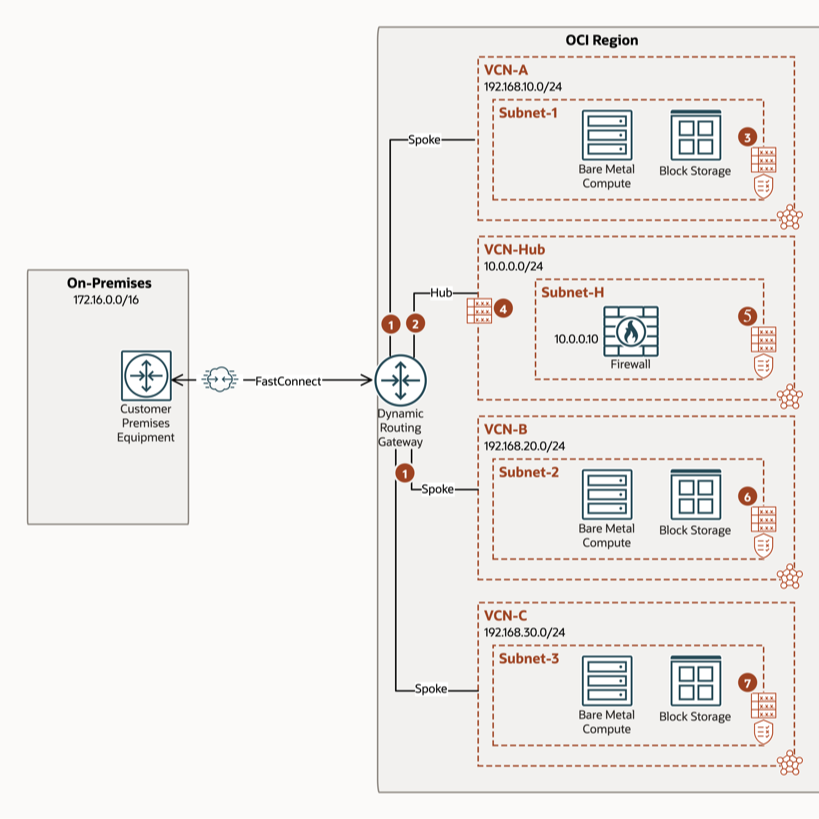

<!-- BEGIN_TF_DOCS -->
# Transit routing with a DRG hub and a network virtual appliance in an attached VCN 

## Description

This is an example for a "***Transit routing with a DRG hub and a network virtual appliance in an attached VCN***" instantiation of the ```terraform-oci-landing-zones-networking``` networking core module.

For detailed description of the ```terraform-oci-landing-zones-networking``` networking core module please refer to the core module specific [README.md](../../README.md) and [SPEC.md](../../SPEC.md).

This example shows a DRG acting as a hub and an attached VCN with a firewall.

For a complete example documentation please access this [OCI Documentation link](https://docs.public.oneportal.content.oci.oraclecloud.com/en-us/iaas/Content/Network/Tasks/scenario_g.htm#scenario_g__onramp_example).

## Diagram of the provisioned networking topology



## Instantiation

For clarity and proper separation and isolation we've separated the input parameters into 2 files by leveraging terraform ```*.auto.tfvars``` feature:

- [terraform.tfvars](./terraform.tfvars.template)


- [network_configuration.auto.tfvars](./network_configuration.auto.tfvars)

### Using the Module with ORM**

For an ad-hoc use where you can select your resources, follow these guidelines:
1. [](https://cloud.oracle.com/resourcemanager/stacks/create?zipUrl=https://github.com/oracle-quickstart/terraform-oci-cis-landing-zone-networking/archive/refs/heads/main.zip&zipUrlVariables={"input_config_file_url":"https://raw.githubusercontent.com/oracle-quickstart/terraform-oci-cis-landing-zone-networking/main/examples/TransitRouting-DRGHub-NFW/input-configs-standards-options/network_configuration.yaml"})
2. Accept terms,  wait for the configuration to load. 
3. Set the working directory to “orm-facade”. 
4. Set the stack name you prefer.
5. Set the Terraform version to 1.3.x or later. Click Next.
6. Add your json/yaml configuration files. Click Next.
8. Un-check run apply. Click Create.

## Network firewall route completion

`VCN-H-INGRESS-RT-KEY` refers to the same-stack firewall with
`network_entity_id: HUB-NFW-KEY`. `network_entity_id` accepts either a literal OCID or
a resource key. The module creates the subnet on its VCN default
route table, creates the firewall and its private IP, creates the route rules, and then
attaches the configured route table. The full example is therefore deployable in one
Terraform apply without copying a private IP OCID into a second configuration file.

During a fresh deployment the subnet can briefly use the VCN default route table. A
firewall replacement or route-table reassignment can interrupt traffic, and initial
traffic convergence still depends on the firewall becoming operational.
