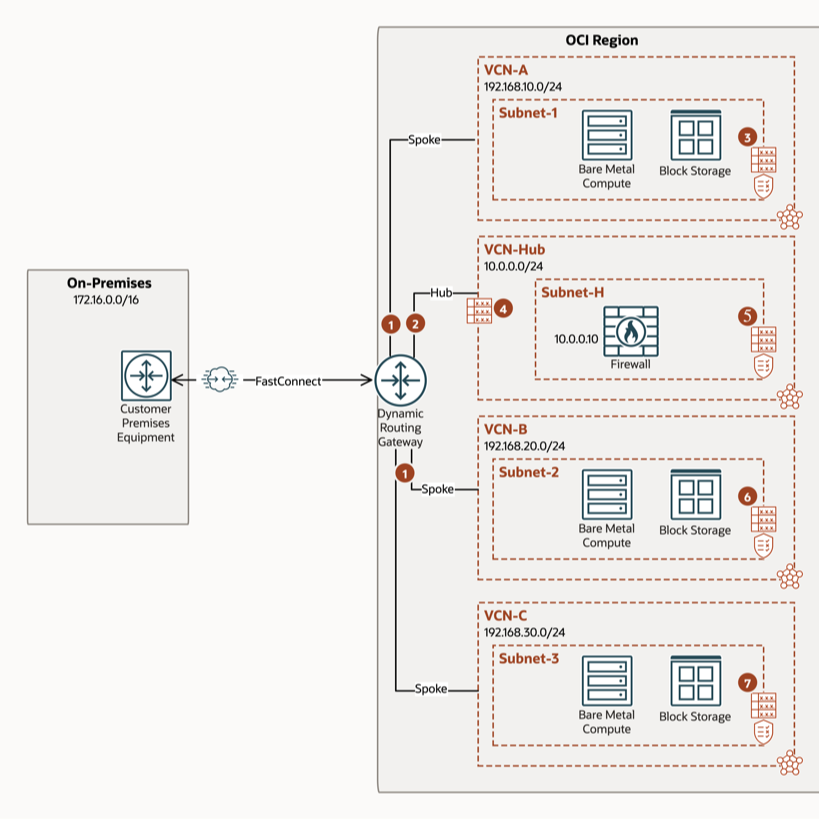

# Transit routing with a DRG hub and OCI Network Firewall

This example connects three spoke VCNs and an on-premises network through a DRG.
Traffic entering the hub VCN is routed through OCI Network Firewall.



The example calls the networking module directly:

```hcl
module "terraform_oci_networking" {
  source                = "../../"
  network_configuration = var.network_configuration
}
```

[network_configuration.json](network_configuration.json) and
[network_configuration.yaml](network_configuration.yaml) contain the same complete
topology. Firewall routes use `network_entity_id = "HUB-NFW-KEY"`
to reference the firewall defined in the same configuration. The module resolves its
private-IP OCID automatically, so the full topology can be deployed in one apply.

## Deploy with Terraform

1. Copy the authentication template:

   ```shell
   cp terraform.tfvars.template terraform.tfvars
   ```

2. Set your OCI authentication values in `terraform.tfvars`. In
   `network_configuration.json`, set `default_compartment_id` and adjust the
   FastConnect provider, BGP peering addresses, CIDRs, and firewall policy for your
   environment.

3. Run Terraform from this directory:

   ```shell
   terraform init
   terraform plan -var-file=network_configuration.json -out=plan.out
   terraform apply plan.out
   ```

## Deploy with OCI Resource Manager

Use either the YAML or JSON configuration. Edit its compartment, FastConnect, and
policy settings for your environment. Set `orm-facade` as the stack's working
directory and set `input_config_file_url` to the URL of your edited configuration
file. Run one plan/apply cycle.

See the module [README](../../README.md) and [specification](../../SPEC.md) for the
available configuration attributes.
