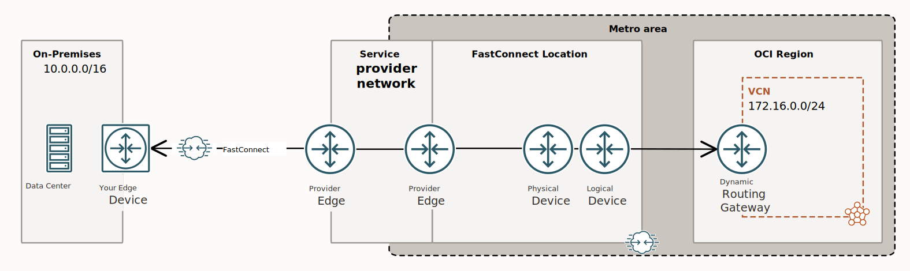

<!-- BEGIN_TF_DOCS -->
# Generic OCI BGP Fast Connect Partner configuration

## Description

This is an example of a standard OCI BGP Fast Connect Partner configuration and provisioning using the ```terraform-oci-landing-zones-networking``` networking core module.

This example is automating the provisioning of the OCI BGP Fast Connect Partner topology described by the [OCI Documentation blog entry](https://docs.oracle.com/en-us/iaas/Content/Network/Concepts/fastconnectprovider.htm).

For a detailed description of the ```terraform-oci-landing-zones-networking``` networking core module please refer to the core module specific [README.md](../../../../README.md) and [SPEC.md](../../../../SPEC.md).

This example leverages the fully dynamic characteristics of the complex networking module input to describe the following networking topology:

- networking construct provisioned on a single compartment
- single networking category defined
- the category will contain one single VCN(172.16.0.0/24)
- the VCN will contain a single private subnet(172.16.0.0/24).
    - One security list with the following rules:
        - allow egress to on premises(10.0.0.0/16) over all TCP ports;
        - allow ingress on TCP:22 from on-premises(10.0.0.0/16)
        - allow ingress on ICMP:all from on-premises(10.0.0.0/16)
    - One gateway:
        - Dynamic Routing Gateway
    - One route table attached to the single subnet, containing one single route rule:
        - next hop to on-premises(10.0.0.0/16) is the DRG.
    - No NSG.
 - One fast connect virtual circuit having Equinix as a fast connect provider.

__NOTE 1:__ Please note that the entire configuration is a single complex input parameter and you're able to edit it and change the resources names and any of their configuration (like VCN and subnet CIDR blocks, dns labels...) and, also, you're able to change the input configuration topology/structure like adding more categories, more VCNs inside a category, more subnets inside a VCN or inject new resources into existing VCNs and this will reflect into the topology that terraform will provision.

__NOTE 2:__ This configuration and automation is only covering the provisioning of the OCI resources.

__NOTE 3:__ Please note the following 2 bool attributes of a fast connect virtual circuit: ```provision_fc_virtual_circuit``` and       ```show_available_fc_virtual_circuit_providers```:
- ```provision_fc_virtual_circuit```:
   - set it to ```false``` when you want just to define a draft fast connect configuration without applying and provisione it.
   - set it to ```true``` when you want to apply and provision the defined fast connect configuration.
- ```show_available_fc_virtual_circuit_providers```:
    - set it to ```true``` when you want to see the available fast connect providers for the current configuration;
   - set it to ```false``` when you do not want to see the available fast connect providers for the current configuration;

The recommendation will be to use the above 2 attributes, in conjunction, in the following 2 use cases:
1. When you do not know the available fast connect partners for a certain draft configuration, define the configuration, set the ```provision_fc_virtual_circuit = false``` and ```show_available_fc_virtual_circuit_providers = true``` and run ```terraform apply```. This will generate in the terraform ouput, for each and every draft fast connect virtual circuit that you've defined, all the available fast connect providers and their details. Pick the provider of your choice and note down either the provider ocid or the provider key.
2. Once you have the provider ocid and/or the provider key update the corresponding fast connect virtual cirtcuit with those and set the ```provision_fc_virtual_circuit = true``` and ```show_available_fc_virtual_circuit_providers = false```. This will provision the configured virtual circuit and will not show anymore all the available providers for that draft fast connect virtual circuit configuration.


## Diagram of the provisioned networking topology



## Instantiation

For clarity and proper separation and isolation, we've separated the input parameters into 2 files by leveraging terraform ```*.auto.tfvars``` feature:

- [terraform.tfvars](./terraform.tfvars.template)

- [oci_network_configuration.auto.tfvars](./oci_network_configuration.auto.tfvars)

### Using the Module with ORM**
[ff](../generic-oci-fastconnect-partn)
For an ad-hoc use where you can select your resources, follow these guidelines:
1. [](https://cloud.oracle.com/resourcemanager/stacks/create?zipUrl=https://github.com/oracle-quickstart/terraform-oci-cis-landing-zone-networking/archive/refs/heads/main.zip&zipUrlVariables={"input_config_file_url":"https://raw.githubusercontent.com/oracle-quickstart/terraform-oci-cis-landing-zone-networking/main/examples/edge-connectivity/fast-connect-examples/generic-oci-fastconnect-partner/input-configs-standards-options/oci_network_configuration.json"})
2. Accept terms,  wait for the configuration to load. 
3. Set the working directory to “orm-facade”. 
4. Set the stack name you prefer.
5. Set the terraform version to 1.2.x. Click Next. 
6. Add your json/yaml configuration files. Click Next.
8. Un-check run apply. Click Create.


## Output Example:

```
provisioned_networking_resources = {
  "cross_connect_groups" = {}
  "cross_connects" = {}
  "customer_premises_equipments" = {}
  "dhcp_options" = {}
  "drg_attachments" = {
    "DRG-VCN-ATTACH-VISION-KEY" = {
      "compartment_id" = "ocid1.compartment.oc1...."
      "defined_tags" = tomap({
        "CCA_Basic_Tag.email" = "oracleidentitycloudservice/cosmin.tudor@oracle.com"
        "Oracle_Tags.CreatedBy" = "oracleidentitycloudservice/cosmin.tudor@oracle.com"
        "Oracle_Tags.CreatedOn" = "2023-08-30T13:21:19.047Z"
      })
      "display_name" = "drg-vcn-attach-vision"
      "drg_id" = "ocid1.drg.oc1.eu-frankfurt-1.aaaaaaaan6u5wviq4pep6vj5udutbggrsuig37huejo2tfpk7wr7b4itvpva"
      "drg_name" = "drg-vision"
      "drg_route_table_id" = "ocid1.drgroutetable.oc1.eu-frankfurt-1.aaaaaaaapcanhbuoojx4bvd6d3tqlrlmkar6fyhsoiswbnbafurwjuzyyazq"
      "drg_route_table_key" = "CANNOT BE DETERMINED - ROUTE TABLE CREATED OUTSIDE THIS AUTOMATION"
      "drg_route_table_name" = "CANNOT BE DETERMINED - ROUTE TABLE CREATED OUTSIDE THIS AUTOMATION"
      "drga_key" = "DRG-VCN-ATTACH-VISION-KEY"
      "export_drg_route_distribution_id" = tostring(null)
      "freeform_tags" = tomap({
        "vision-environment" = "vision"
        "vision-oci-aws-ipsec" = "demo"
      })
      "id" = "ocid1.drgattachment.oc1.eu-frankfurt-1.aaaaaaaapfjzbc45ds3fq7vgdkazcwanhjqonwjrjzebz3k3wx5ik4ufsnyq"
      "is_cross_tenancy" = false
      "network_configuration_category" = "demo"
      "network_details" = tolist([
        {
          "attached_resource_key" = "VISION-GENERIC-FC-VCN-KEY"
          "attached_resource_name" = "vision-generic-fc-vcn"
          "id" = "ocid1.vcn.oc1.eu-frankfurt-1.amaaaaaattkvkkiaw32n7fzgqb35n5ldk44vojagq3rv3nxkln36bcjkmiaq"
          "ipsec_connection_id" = ""
          "route_table_id" = ""
          "route_table_key" = tostring(null)
          "route_table_name" = tostring(null)
          "type" = "VCN"
          "vcn_route_type" = "SUBNET_CIDRS"
        },
      ])
      "remove_export_drg_route_distribution_trigger" = tobool(null)
      "route_table_id" = tostring(null)
      "route_table_key" = tostring(null)
      "route_table_name" = tostring(null)
      "state" = "ATTACHED"
      "time_created" = "2023-08-30 13:21:19.42 +0000 UTC"
      "timeouts" = null /* object */
      "vcn_id" = "ocid1.vcn.oc1.eu-frankfurt-1.amaaaaaattkvkkiaw32n7fzgqb35n5ldk44vojagq3rv3nxkln36bcjkmiaq"
      "vcn_key" = "VISION-GENERIC-FC-VCN-KEY"
      "vcn_name" = "vision-generic-fc-vcn"
    }
  }
  "drg_route_distributions" = {}
  "drg_route_distributions_statements" = {}
  "drg_route_table_route_rules" = {}
  "drg_route_tables" = {}
  "dynamic_routing_gateways" = {
    "DRG-VISION-KEY" = {
      "compartment_id" = "ocid1.compartment.oc1...."
      "default_drg_route_tables" = tolist([
        {
          "ipsec_tunnel" = "ocid1.drgroutetable.oc1.eu-frankfurt-1.aaaaaaaa46c6alrkbcugotrp4icoms7p47perurf5lh6uypr6ibhermtmmvq"
          "remote_peering_connection" = "ocid1.drgroutetable.oc1.eu-frankfurt-1.aaaaaaaa46c6alrkbcugotrp4icoms7p47perurf5lh6uypr6ibhermtmmvq"
          "vcn" = "ocid1.drgroutetable.oc1.eu-frankfurt-1.aaaaaaaapcanhbuoojx4bvd6d3tqlrlmkar6fyhsoiswbnbafurwjuzyyazq"
          "virtual_circuit" = "ocid1.drgroutetable.oc1.eu-frankfurt-1.aaaaaaaa46c6alrkbcugotrp4icoms7p47perurf5lh6uypr6ibhermtmmvq"
        },
      ])
      "default_export_drg_route_distribution_id" = "ocid1.drgroutedistribution.oc1.eu-frankfurt-1.aaaaaaaafdi5jpqrq543amzd3p2gau4pcinrwyw5cvu2vj3t2vc7bomnvf2a"
      "defined_tags" = tomap({
        "CCA_Basic_Tag.email" = "oracleidentitycloudservice/cosmin.tudor@oracle.com"
        "Oracle_Tags.CreatedBy" = "oracleidentitycloudservice/cosmin.tudor@oracle.com"
        "Oracle_Tags.CreatedOn" = "2023-08-30T13:21:10.597Z"
      })
      "display_name" = "drg-vision"
      "freeform_tags" = tomap({
        "vision-environment" = "vision"
        "vision-oci-aws-ipsec" = "demo"
      })
      "id" = "ocid1.drg.oc1.eu-frankfurt-1.aaaaaaaan6u5wviq4pep6vj5udutbggrsuig37huejo2tfpk7wr7b4itvpva"
      "network_configuration_category" = "demo"
      "redundancy_status" = "NOT_AVAILABLE"
      "state" = "AVAILABLE"
      "time_created" = "2023-08-30 13:21:10.64 +0000 UTC"
      "timeouts" = null /* object */
    }
  }
  "fast_connect_virtual_circuits" = {
    "available_fast_connect_provider_services" = {}
    "fast_connect_virtual_circuits" = {
      "VISON-FC-VC-1-KEY" = {
        "bandwidth_shape_name" = "1 Gbps"
        "bgp_admin_state" = "ENABLED"
        "bgp_ipv6session_state" = "DOWN"
        "bgp_management" = "CUSTOMER_MANAGED"
        "bgp_session_state" = "DOWN"
        "compartment_id" = "ocid1.compartment.oc1...."
        "cross_connect_mappings" = tolist([
          {
            "bgp_md5auth_key" = ""
            "cross_connect_or_cross_connect_group_id" = ""
            "customer_bgp_peering_ip" = "192.168.3.1/30"
            "customer_bgp_peering_ipv6" = ""
            "oracle_bgp_peering_ip" = "192.168.3.2/30"
            "oracle_bgp_peering_ipv6" = ""
            "vlan" = 0
          },
        ])
        "customer_asn" = "65000"
        "customer_bgp_asn" = tonumber(null)
        "defined_tags" = tomap({
          "CCA_Basic_Tag.email" = "oracleidentitycloudservice/cosmin.tudor@oracle.com"
          "Oracle_Tags.CreatedBy" = "oracleidentitycloudservice/cosmin.tudor@oracle.com"
          "Oracle_Tags.CreatedOn" = "2023-08-30T13:23:45.573Z"
        })
        "display_name" = "vision_fc_vc_01"
        "drg_key" = "DRG-VISION-KEY"
        "drg_name" = "drg-vision"
        "fcvc_key" = "VISON-FC-VC-1-KEY"
        "freeform_tags" = tomap({
          "vision-environment" = "vision"
          "vision-oci-aws-ipsec" = "demo"
        })
        "gateway_id" = "ocid1.drg.oc1.eu-frankfurt-1.aaaaaaaan6u5wviq4pep6vj5udutbggrsuig37huejo2tfpk7wr7b4itvpva"
        "id" = "ocid1.virtualcircuit.oc1.eu-frankfurt-1.aaaaaaaac6ul7mitm5iexc56jhurjkzp2zsdcophwu5fqcx333ahbklh2u2a"
        "ip_mtu" = "MTU_1500"
        "is_bfd_enabled" = false
        "network_configuration_category" = "demo"
        "oracle_bgp_asn" = 31898
        "provider_service_details" = {
          "VISION-FC-VC-01-EQUINIX-FABRIC-KEY" = {
            "bandwith_shape_management" = "CUSTOMER_MANAGED"
            "customer_asn_management" = "CUSTOMER_MANAGED"
            "description" = "https://www.equinix.com/interconnection-services/equinix-fabric"
            "fc_provider_service_key" = "VISION-FC-VC-01-EQUINIX-FABRIC-KEY"
            "fcvc_display_name" = "vision_fc_vc_01"
            "fcvc_key" = "VISON-FC-VC-1-KEY"
            "id" = "ocid1.providerservice.oc1.eu-frankfurt-1.aaaaaaaauyqhkug34caqfdamhfyt7gnrwlkghwnm5q2xkazvuj7zkyntgilq"
            "private_peering_bgp_management" = "CUSTOMER_MANAGED"
            "provider_name" = "Equinix"
            "provider_service_key_management" = "PROVIDER_MANAGED"
            "provider_service_name" = "Fabric"
            "public_peering_bgp_management" = "ORACLE_MANAGED"
            "required_total_cross_connects" = 1
            "supported_virtual_circuit_types" = tolist([
              "PRIVATE",
              "PUBLIC",
            ])
            "type" = "LAYER2"
          }
        }
        "provider_service_id" = "ocid1.providerservice.oc1.eu-frankfurt-1.aaaaaaaauyqhkug34caqfdamhfyt7gnrwlkghwnm5q2xkazvuj7zkyntgilq"
        "provider_service_key_name" = tostring(null)
        "provider_state" = "INACTIVE"
        "public_prefixes" = toset([])
        "reference_comment" = tostring(null)
        "region" = tostring(null)
        "routing_policy" = tolist([
          "MARKET_LEVEL",
        ])
        "service_type" = "LAYER2"
        "state" = "PENDING_PROVIDER"
        "time_created" = "2023-08-30 13:23:45.821 +0000 UTC"
        "timeouts" = null /* object */
        "type" = "PRIVATE"
      }
    }
  }
  "internet_gateways" = {}
  "ip_sec_vpns" = {}
  "ipsec_tunnels_management" = {}
  "l7_load_balancers" = {
    "l7_lb_back_ends" = {}
    "l7_lb_backend_sets" = {}
    "l7_lb_certificates" = {}
    "l7_lb_cipher_suites" = {}
    "l7_lb_hostnames" = {}
    "l7_lb_listeners" = {}
    "l7_lb_path_route_sets" = {}
    "l7_lb_routing_policies" = {}
    "l7_lb_rule_sets" = {}
    "l7_load_balancers" = {}
  }
  "local_peering_gateways" = {}
  "nat_gateways" = {}
  "network_security_groups" = {}
  "network_security_groups_egress_rules" = {}
  "network_security_groups_ingress_rules" = {}
  "oci_network_firewall_network_firewall_policies" = {}
  "oci_network_firewall_network_firewalls" = {}
  "public_ips" = {}
  "public_ips_pools" = {}
  "remote_peering_connections" = {}
  "route_tables" = {
    "DEFAULT_ROUTE_TABLE_FOR_VISION-GENERIC-FC-VCN-KEY" = {
      "compartment_id" = "ocid1.compartment.oc1...."
      "defined_tags" = tomap({
        "CCA_Basic_Tag.email" = "oracleidentitycloudservice/cosmin.tudor@oracle.com"
        "Oracle_Tags.CreatedBy" = "oracleidentitycloudservice/cosmin.tudor@oracle.com"
        "Oracle_Tags.CreatedOn" = "2023-08-30T13:21:10.493Z"
      })
      "display_name" = "Default Route Table for vision-generic-fc-vcn"
      "freeform_tags" = tomap({
        "vision-environment" = "vision"
        "vision-oci-aws-ipsec" = "demo"
      })
      "id" = "ocid1.routetable.oc1.eu-frankfurt-1.aaaaaaaadb3ua5rhv33efem3xithi77e2fuozoi4pcezpv3nowuzy6nlf6jq"
      "network_configuration_category" = "demo"
      "route_rules" = tolist([])
      "route_table_key" = "DEFAULT_ROUTE_TABLE_FOR_VISION-GENERIC-FC-VCN-KEY"
      "state" = "AVAILABLE"
      "time_created" = "2023-08-30 13:21:10.615 +0000 UTC"
      "vcn_id" = "ocid1.vcn.oc1.eu-frankfurt-1.amaaaaaattkvkkiaw32n7fzgqb35n5ldk44vojagq3rv3nxkln36bcjkmiaq"
      "vcn_key" = "VISION-GENERIC-FC-VCN-KEY"
      "vcn_name" = "vision-generic-fc-vcn"
    }
    "RT-01-KEY" = {
      "compartment_id" = "ocid1.compartment.oc1...."
      "defined_tags" = tomap({})
      "display_name" = "rt-01"
      "freeform_tags" = tomap({
        "vision-environment" = "vision"
        "vision-oci-aws-ipsec" = "demo"
      })
      "id" = "ocid1.routetable.oc1.eu-frankfurt-1.aaaaaaaacoowwxgtmy4agtoeze3e6dspdcisdwkvpndcfascvjhwl7icunra"
      "network_configuration_category" = "demo"
      "route_rules" = toset([
        {
          "cidr_block" = ""
          "description" = "Route for on-premises over IPSEC VPN"
          "destination" = "10.0.0.0/16"
          "destination_type" = "CIDR_BLOCK"
          "network_entity_id" = "ocid1.drg.oc1.eu-frankfurt-1.aaaaaaaan6u5wviq4pep6vj5udutbggrsuig37huejo2tfpk7wr7b4itvpva"
          "route_type" = ""
        },
      ])
      "route_table_key" = "RT-01-KEY"
      "state" = "AVAILABLE"
      "time_created" = "2023-08-30 13:21:18.494 +0000 UTC"
      "timeouts" = null /* object */
      "vcn_id" = "ocid1.vcn.oc1.eu-frankfurt-1.amaaaaaattkvkkiaw32n7fzgqb35n5ldk44vojagq3rv3nxkln36bcjkmiaq"
      "vcn_key" = "VISION-GENERIC-FC-VCN-KEY"
      "vcn_name" = "vision-generic-fc-vcn"
    }
  }
  "route_tables_attachments" = {
    "PRIVATE-REGIONAL-SUBNET-KEY" = {
      "id" = "ocid1.subnet.oc1.eu-frankfurt-1.aaaaaaaacnqdgsghfcc4fr2ltzoz6pllgqog5tfsmd44zfmcnqvf6m3ngkta/ocid1.routetable.oc1.eu-frankfurt-1.aaaaaaaacoowwxgtmy4agtoeze3e6dspdcisdwkvpndcfascvjhwl7icunra"
      "network_configuration_category" = "demo"
      "route_table_id" = "ocid1.routetable.oc1.eu-frankfurt-1.aaaaaaaacoowwxgtmy4agtoeze3e6dspdcisdwkvpndcfascvjhwl7icunra"
      "route_table_key" = "RT-01-KEY"
      "route_table_name" = "rt-01"
      "rta_key" = "PRIVATE-REGIONAL-SUBNET-KEY"
      "subnet_id" = "ocid1.subnet.oc1.eu-frankfurt-1.aaaaaaaacnqdgsghfcc4fr2ltzoz6pllgqog5tfsmd44zfmcnqvf6m3ngkta"
      "subnet_key" = "PRIVATE-REGIONAL-SUBNET-KEY"
      "subnet_name" = "private-regional-sub"
      "timeouts" = null /* object */
      "vcn_key" = "VISION-GENERIC-FC-VCN-KEY"
      "vcn_name" = "vision-generic-fc-vcn"
    }
  }
  "security_lists" = {
    "SECLIST-01-KEY" = {
      "compartment_id" = "ocid1.compartment.oc1...."
      "defined_tags" = tomap({})
      "display_name" = "prv-subnet"
      "egress_security_rules" = toset([
        {
          "description" = "egress to 10.0.0.0/16 over all TCP ports"
          "destination" = "10.0.0.0/16"
          "destination_type" = "CIDR_BLOCK"
          "icmp_options" = tolist([])
          "protocol" = "6"
          "stateless" = false
          "tcp_options" = tolist([])
          "udp_options" = tolist([])
        },
      ])
      "freeform_tags" = tomap({
        "vision-environment" = "vision"
        "vision-oci-aws-ipsec" = "demo"
      })
      "id" = "ocid1.securitylist.oc1.eu-frankfurt-1.aaaaaaaanpelrzqeq3g5yrnmrg745yrazj7tddsvc4nseb4mixcqz7gh3g2a"
      "ingress_security_rules" = toset([
        {
          "description" = "ingress from 10.0.0.0/16 over ICMP:all"
          "icmp_options" = tolist([])
          "protocol" = "1"
          "source" = "10.0.0.0/16"
          "source_type" = "CIDR_BLOCK"
          "stateless" = false
          "tcp_options" = tolist([])
          "udp_options" = tolist([])
        },
        {
          "description" = "ingress from 10.0.0.0/16 over TCP:22"
          "icmp_options" = tolist([])
          "protocol" = "6"
          "source" = "10.0.0.0/16"
          "source_type" = "CIDR_BLOCK"
          "stateless" = false
          "tcp_options" = tolist([
            {
              "max" = 22
              "min" = 22
              "source_port_range" = tolist([])
            },
          ])
          "udp_options" = tolist([])
        },
      ])
      "network_configuration_category" = "demo"
      "sec_list_key" = "SECLIST-01-KEY"
      "state" = "AVAILABLE"
      "time_created" = "2023-08-30 13:21:11.416 +0000 UTC"
      "timeouts" = null /* object */
      "vcn_id" = "ocid1.vcn.oc1.eu-frankfurt-1.amaaaaaattkvkkiaw32n7fzgqb35n5ldk44vojagq3rv3nxkln36bcjkmiaq"
      "vcn_key" = "VISION-GENERIC-FC-VCN-KEY"
      "vcn_name" = "vision-generic-fc-vcn"
    }
  }
  "service_gateways" = {}
  "subnets" = {
    "PRIVATE-REGIONAL-SUBNET-KEY" = {
      "availability_domain" = tostring(null)
      "cidr_block" = "172.16.0.0/24"
      "compartment_id" = "ocid1.compartment.oc1...."
      "defined_tags" = tomap({})
      "dhcp_options_id" = "ocid1.dhcpoptions.oc1.eu-frankfurt-1.aaaaaaaa7qhvdf4sq5aexhcpndg2kyasch3aqpeajzmdqzr6blivbzsxrn2q"
      "dhcp_options_key" = "default_dhcp_options"
      "dhcp_options_name" = "default_dhcp_options"
      "display_name" = "private-regional-sub"
      "dns_label" = "prv"
      "freeform_tags" = tomap({
        "vision-environment" = "vision"
        "vision-oci-aws-ipsec" = "demo"
      })
      "id" = "ocid1.subnet.oc1.eu-frankfurt-1.aaaaaaaacnqdgsghfcc4fr2ltzoz6pllgqog5tfsmd44zfmcnqvf6m3ngkta"
      "ipv6cidr_block" = tostring(null)
      "ipv6cidr_blocks" = tolist([])
      "ipv6virtual_router_ip" = tostring(null)
      "network_configuration_category" = "demo"
      "prohibit_internet_ingress" = true
      "prohibit_public_ip_on_vnic" = true
      "route_table_id" = "ocid1.routetable.oc1.eu-frankfurt-1.aaaaaaaacoowwxgtmy4agtoeze3e6dspdcisdwkvpndcfascvjhwl7icunra"
      "route_table_key" = "RT-01-KEY"
      "route_table_name" = "rt-01"
      "security_lists" = {
        "ocid1.securitylist.oc1.eu-frankfurt-1.aaaaaaaanpelrzqeq3g5yrnmrg745yrazj7tddsvc4nseb4mixcqz7gh3g2a" = {
          "display_name" = "prv-subnet"
          "sec_list_key" = "SECLIST-01-KEY"
        }
      }
      "state" = "UPDATING"
      "subnet_domain_name" = "prv.visionvcn.oraclevcn.com"
      "subnet_key" = "PRIVATE-REGIONAL-SUBNET-KEY"
      "time_created" = "2023-08-30 13:21:11.976 +0000 UTC"
      "timeouts" = null /* object */
      "vcn_id" = "ocid1.vcn.oc1.eu-frankfurt-1.amaaaaaattkvkkiaw32n7fzgqb35n5ldk44vojagq3rv3nxkln36bcjkmiaq"
      "vcn_key" = "VISION-GENERIC-FC-VCN-KEY"
      "vcn_name" = "vision-generic-fc-vcn"
      "virtual_router_ip" = "172.16.0.1"
      "virtual_router_mac" = "00:00:17:4B:1B:EF"
    }
  }
  "vcns" = {
    "VISION-GENERIC-FC-VCN-KEY" = {
      "byoipv6cidr_blocks" = tolist([])
      "byoipv6cidr_details" = tolist([])
      "cidr_block" = "172.16.0.0/24"
      "cidr_blocks" = tolist([
        "172.16.0.0/24",
      ])
      "compartment_id" = "ocid1.compartment.oc1...."
      "default_dhcp_options_id" = "ocid1.dhcpoptions.oc1.eu-frankfurt-1.aaaaaaaa7qhvdf4sq5aexhcpndg2kyasch3aqpeajzmdqzr6blivbzsxrn2q"
      "default_route_table_id" = "ocid1.routetable.oc1.eu-frankfurt-1.aaaaaaaadb3ua5rhv33efem3xithi77e2fuozoi4pcezpv3nowuzy6nlf6jq"
      "default_security_list_id" = "ocid1.securitylist.oc1.eu-frankfurt-1.aaaaaaaarzkxkk5pl7megb65uuzhi4hs7f55t4fkqgkwde7ouvd6sqsurbiq"
      "defined_tags" = tomap({})
      "display_name" = "vision-generic-fc-vcn"
      "dns_label" = "visionvcn"
      "freeform_tags" = tomap({
        "vision-environment" = "vision"
        "vision-oci-aws-ipsec" = "demo"
      })
      "id" = "ocid1.vcn.oc1.eu-frankfurt-1.amaaaaaattkvkkiaw32n7fzgqb35n5ldk44vojagq3rv3nxkln36bcjkmiaq"
      "ipv6cidr_blocks" = tolist([])
      "ipv6private_cidr_blocks" = tolist([])
      "is_ipv6enabled" = false
      "is_oracle_gua_allocation_enabled" = tobool(null)
      "network_configuration_category" = "demo"
      "state" = "AVAILABLE"
      "time_created" = "2023-08-30 13:21:10.615 +0000 UTC"
      "timeouts" = null /* object */
      "vcn_domain_name" = "visionvcn.oraclevcn.com"
      "vcn_key" = "VISION-GENERIC-FC-VCN-KEY"
    }
  }
}
```
