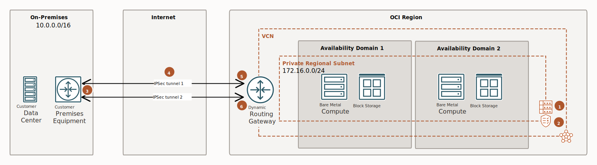

<!-- BEGIN_TF_DOCS -->
# Generic OCI IPSEC VPN BGP configuration

## Description

This is an example of a standard Site-To-Site OCI IPSEC BGP VPN configuration and provisioning using the ```terraform-oci-landing-zones-networking``` networking core module.

This example is automating the provisioning of the OCI IPSEC VPN topology described by the [OCI Documentation blog entry](https://docs.oracle.com/en-us/iaas/Content/Network/Tasks/settingupIPsec.htm).

For a detailed description of the ```terraform-oci-landing-zones-networking``` networking core module please refer to the core module specific [README.md](../../../../README.md) and [SPEC.md](../../../../SPEC.md).

This example leverages the fully dynamic characteristics of the complex networking module input to describe the following networking topology:

- networking construct provisioned on a single compartment
- single networking category defined
- the category will contain one single VCN(172.16.0.0/24)
- the VCN will contain a single private subnet(172.16.0.0/24).
    - One security list with the following rules:
        - allow egress to on premises(10.0.0.0/16) over all TCP ports;
        - allow ingress on TCP:22 from on-premises(10.0.0.0/16)
        - allow ingress on ICMP:all from on-premises(10.0.0.0/16)
    - One gateway:
        - Dynamic Routing Gateway
    - One route table attached to the single subnet, containing one single route rule:
        - next hop to on-premises(10.0.0.0/16) is the DRG.
    - No NSG.
 - One CPE: Fortinet - 142.34.145.37
 - One IpSec Virtual circuit with 2 BGP tunnels.

__NOTE 1:__ Please note that the entire configuration is a single complex input parameter and you're able to edit it and change the resources names and any of their configuration (like VCN and subnet CIDR blocks, dns labels...) and, also, you're able to change the input configuration topology/structure like adding more categories, more VCNs inside a category, more subnets inside a VCN or inject new resources into existing VCNs and this will reflect into the topology that terraform will provision.

__NOTE 2:__ This configuration and automation is only covering the provisioning of the OCI resources.

## Diagram of the provisioned networking topology



## Instantiation

For clarity and proper separation and isolation we've separated the input parameters into 2 files by leveraging terraform ```*.auto.tfvars``` feature:

- [terraform.tfvars](./terraform.tfvars.template)


- [oci_network_configuration.auto.tfvars](./oci_network_configuration.auto.tfvars)

### Using the Module with ORM**

For an ad-hoc use where you can select your resources, follow these guidelines:
1. [](https://cloud.oracle.com/resourcemanager/stacks/create?zipUrl=https://github.com/oracle-quickstart/terraform-oci-cis-landing-zone-networking/archive/refs/heads/main.zip&zipUrlVariables={"input_config_file_url":"https://raw.githubusercontent.com/oracle-quickstart/terraform-oci-cis-landing-zone-networking/main/examples/edge-connectivity/ipsec-examples/generic-OCI-ipsec-bgp-vpn/input-configs-standards-options/oci_network_configuration.json"})
2. Accept terms,  wait for the configuration to load. 
3. Set the working directory to “orm-facade”. 
4. Set the stack name you prefer.
5. Set the terraform version to 1.2.x. Click Next. 
6. Add your json/yaml configuration files. Click Next.
8. Un-check run apply. Click Create.


## Output Example:

```
provisioned_networking_resources = {
  "cross_connect_groups" = {}
  "cross_connects" = {}
  "customer_premises_equipments" = {
    "CPE-VISION-KEY" = {
      "compartment_id" = "ocid1.compartment.oc1...."
      "cpe_device_shape_details" = {
        "cpe_device_info" = tolist([
          {
            "platform_software_version" = "FortiGate 6.0.4 or later"
            "vendor" = "Fortinet"
          },
        ])
        "cpe_device_shape_id" = "15addf76-6ecd-4a76-a1e7-527edd848471"
        "template" = ""
      }
      "cpe_device_shape_id" = "15addf76-6ecd-4a76-a1e7-527edd848471"
      "cpe_key" = "CPE-VISION-KEY"
      "defined_tags" = tomap({})
      "display_name" = "cpe-vision"
      "freeform_tags" = tomap({
        "vision-environment" = "vision"
        "vision-oci-aws-ipsec" = "demo"
      })
      "id" = "ocid1.cpe.oc1.eu-frankfurt-1.aaaaaaaa65qif35yf3ejoxjrvynkvvb6ida7ojkgzcp7ixpvufeh73e6nzza"
      "ip_address" = "142.34.145.37"
      "network_configuration_category" = "demo"
      "time_created" = "2023-08-30 12:02:43.601 +0000 UTC"
      "timeouts" = null /* object */
    }
  }
  "dhcp_options" = {}
  "drg_attachments" = {
    "DRG-VCN-ATTACH-VISION-KEY" = {
      "compartment_id" = "ocid1.compartment.oc1...."
      "defined_tags" = tomap({
        "CCA_Basic_Tag.email" = "oracleidentitycloudservice/cosmin.tudor@oracle.com"
        "Oracle_Tags.CreatedBy" = "oracleidentitycloudservice/cosmin.tudor@oracle.com"
        "Oracle_Tags.CreatedOn" = "2023-08-30T12:02:59.119Z"
      })
      "display_name" = "drg-vcn-attach-vision"
      "drg_id" = "ocid1.drg.oc1.eu-frankfurt-1.aaaaaaaafjyjmxeifllycj4n7cljdx2u4d2gqytendpa6fpg6wybojptqnwq"
      "drg_name" = "drg-vision"
      "drg_route_table_id" = "ocid1.drgroutetable.oc1.eu-frankfurt-1.aaaaaaaaj3zempwvil3axqv2xpaaajwpa2jfoxu27hjygowzk2t2syiau6dq"
      "drg_route_table_key" = "CANNOT BE DETERMINED - ROUTE TABLE CREATED OUTSIDE THIS AUTOMATION"
      "drg_route_table_name" = "CANNOT BE DETERMINED - ROUTE TABLE CREATED OUTSIDE THIS AUTOMATION"
      "drga_key" = "DRG-VCN-ATTACH-VISION-KEY"
      "export_drg_route_distribution_id" = tostring(null)
      "freeform_tags" = tomap({
        "vision-environment" = "vision"
        "vision-oci-aws-ipsec" = "demo"
      })
      "id" = "ocid1.drgattachment.oc1.eu-frankfurt-1.aaaaaaaaqndfuw74fnikgudrtf5gk34ypohsks35fbbzeuajpeq6fgee5baa"
      "is_cross_tenancy" = false
      "network_configuration_category" = "demo"
      "network_details" = tolist([
        {
          "attached_resource_key" = "VISION-GENERIC-VPN-VCN-KEY"
          "attached_resource_name" = "vision-generic-vpn-vcn"
          "id" = "ocid1.vcn.oc1.eu-frankfurt-1.amaaaaaattkvkkialykkg66l6harwpizohw4bejw3v2xhxmqi7tppeupsnwa"
          "ipsec_connection_id" = ""
          "route_table_id" = ""
          "route_table_key" = tostring(null)
          "route_table_name" = tostring(null)
          "type" = "VCN"
          "vcn_route_type" = "SUBNET_CIDRS"
        },
      ])
      "remove_export_drg_route_distribution_trigger" = tobool(null)
      "route_table_id" = tostring(null)
      "route_table_key" = tostring(null)
      "route_table_name" = tostring(null)
      "state" = "ATTACHED"
      "time_created" = "2023-08-30 12:02:59.232 +0000 UTC"
      "timeouts" = null /* object */
      "vcn_id" = "ocid1.vcn.oc1.eu-frankfurt-1.amaaaaaattkvkkialykkg66l6harwpizohw4bejw3v2xhxmqi7tppeupsnwa"
      "vcn_key" = "VISION-GENERIC-VPN-VCN-KEY"
      "vcn_name" = "vision-generic-vpn-vcn"
    }
  }
  "drg_route_distributions" = {}
  "drg_route_distributions_statements" = {}
  "drg_route_table_route_rules" = {}
  "drg_route_tables" = {}
  "dynamic_routing_gateways" = {
    "DRG-VISION-KEY" = {
      "compartment_id" = "ocid1.compartment.oc1...."
      "default_drg_route_tables" = tolist([
        {
          "ipsec_tunnel" = "ocid1.drgroutetable.oc1.eu-frankfurt-1.aaaaaaaa6pgxsixvtk3p4qns7ixidvyw46pjwasrz27sncetezy24znxnfna"
          "remote_peering_connection" = "ocid1.drgroutetable.oc1.eu-frankfurt-1.aaaaaaaa6pgxsixvtk3p4qns7ixidvyw46pjwasrz27sncetezy24znxnfna"
          "vcn" = "ocid1.drgroutetable.oc1.eu-frankfurt-1.aaaaaaaaj3zempwvil3axqv2xpaaajwpa2jfoxu27hjygowzk2t2syiau6dq"
          "virtual_circuit" = "ocid1.drgroutetable.oc1.eu-frankfurt-1.aaaaaaaa6pgxsixvtk3p4qns7ixidvyw46pjwasrz27sncetezy24znxnfna"
        },
      ])
      "default_export_drg_route_distribution_id" = "ocid1.drgroutedistribution.oc1.eu-frankfurt-1.aaaaaaaatve75ekwpmifw5x5l4esms4saqg2uner3rjsqfnr3iimorwulkta"
      "defined_tags" = tomap({
        "CCA_Basic_Tag.email" = "oracleidentitycloudservice/cosmin.tudor@oracle.com"
        "Oracle_Tags.CreatedBy" = "oracleidentitycloudservice/cosmin.tudor@oracle.com"
        "Oracle_Tags.CreatedOn" = "2023-08-30T12:02:43.506Z"
      })
      "display_name" = "drg-vision"
      "freeform_tags" = tomap({
        "vision-environment" = "vision"
        "vision-oci-aws-ipsec" = "demo"
      })
      "id" = "ocid1.drg.oc1.eu-frankfurt-1.aaaaaaaafjyjmxeifllycj4n7cljdx2u4d2gqytendpa6fpg6wybojptqnwq"
      "network_configuration_category" = "demo"
      "redundancy_status" = "NOT_REDUNDANT_NO_CONNECTION"
      "state" = "AVAILABLE"
      "time_created" = "2023-08-30 12:02:43.748 +0000 UTC"
      "timeouts" = null /* object */
    }
  }
  "fast_connect_virtual_circuits" = {
    "available_fast_connect_provider_services" = {}
    "fast_connect_virtual_circuits" = {}
  }
  "internet_gateways" = {}
  "ip_sec_vpns" = {
    "VISION-OCI-AWS-IPSEC-VPN-KEY" = {
      "compartment_id" = "ocid1.compartment.oc1...."
      "cpe_id" = "ocid1.cpe.oc1.eu-frankfurt-1.aaaaaaaa65qif35yf3ejoxjrvynkvvb6ida7ojkgzcp7ixpvufeh73e6nzza"
      "cpe_key" = "CPE-VISION-KEY"
      "cpe_local_identifier" = "142.34.145.37"
      "cpe_local_identifier_type" = "IP_ADDRESS"
      "cpe_name" = "cpe-vision"
      "defined_tags" = tomap({})
      "display_name" = "vision-oci-aws-ipsec-vpn"
      "drg_id" = "ocid1.drg.oc1.eu-frankfurt-1.aaaaaaaafjyjmxeifllycj4n7cljdx2u4d2gqytendpa6fpg6wybojptqnwq"
      "drg_key" = "DRG-VISION-KEY"
      "drg_name" = "drg-vision"
      "freeform_tags" = tomap({
        "vision-environment" = "vision"
        "vision-oci-aws-ipsec" = "demo"
      })
      "id" = "ocid1.ipsecconnection.oc1.eu-frankfurt-1.aaaaaaaak47uwn34yvpdo6f52eivtibd2snbbqvgu7elu22sejrqh5geqqiq"
      "ipsec_key" = "VISION-OCI-AWS-IPSEC-VPN-KEY"
      "network_configuration_category" = "demo"
      "time_created" = "2023-08-30 12:02:58.221 +0000 UTC"
      "timeouts" = null /* object */
    }
  }
  "ipsec_tunnels_management" = {
    "VISION-OCI-AWS-IPSEC-VPN-TUNNEL-1-KEY" = {
      "bgp_session_info" = tolist([
        {
          "bgp_ipv6state" = "DOWN"
          "bgp_state" = "DOWN"
          "customer_bgp_asn" = "12345"
          "customer_interface_ip" = "10.0.0.16/31"
          "oracle_bgp_asn" = "31898"
          "oracle_interface_ip" = "10.0.0.17/31"
        },
      ])
      "compartment_id" = "ocid1.compartment.oc1...."
      "cpe_id" = "ocid1.cpe.oc1.eu-frankfurt-1.aaaaaaaa65qif35yf3ejoxjrvynkvvb6ida7ojkgzcp7ixpvufeh73e6nzza"
      "cpe_ip" = "142.34.145.37"
      "cpe_key" = "CPE-VISION-KEY"
      "cpe_name" = "cpe-vision"
      "display_name" = "vision-oci-aws-ipsec-vpn_tunnel_1"
      "dpd_config" = tolist([])
      "dpd_mode" = "INITIATE_AND_RESPOND"
      "dpd_timeout_in_sec" = 20
      "drg_id" = "ocid1.drg.oc1.eu-frankfurt-1.aaaaaaaafjyjmxeifllycj4n7cljdx2u4d2gqytendpa6fpg6wybojptqnwq"
      "drg_key" = "DRG-VISION-KEY"
      "drg_name" = "drg-vision"
      "encryption_domain_config" = tolist([])
      "id" = "ocid1.ipsectunnel.oc1.eu-frankfurt-1.aaaaaaaaqkxzw4dor2iblfnuoqirsdqeox23i4q7dsia2qtykd54gi7cuyqq"
      "ike_version" = "V1"
      "ipsec_id" = "ocid1.ipsecconnection.oc1.eu-frankfurt-1.aaaaaaaak47uwn34yvpdo6f52eivtibd2snbbqvgu7elu22sejrqh5geqqiq"
      "ipsec_key" = "VISION-OCI-AWS-IPSEC-VPN-KEY"
      "nat_translation_enabled" = "AUTO"
      "network_configuration_category" = "demo"
      "oracle_can_initiate" = "INITIATOR_OR_RESPONDER"
      "phase_one_details" = tolist([
        {
          "custom_authentication_algorithm" = ""
          "custom_dh_group" = ""
          "custom_encryption_algorithm" = ""
          "is_custom_phase_one_config" = false
          "is_ike_established" = false
          "lifetime" = 28800
          "negotiated_authentication_algorithm" = ""
          "negotiated_dh_group" = ""
          "negotiated_encryption_algorithm" = ""
          "remaining_lifetime" = ""
          "remaining_lifetime_last_retrieved" = "2023-08-30 12:25:15.643 +0000 UTC"
        },
      ])
      "phase_two_details" = tolist([
        {
          "custom_authentication_algorithm" = ""
          "custom_encryption_algorithm" = ""
          "dh_group" = "GROUP5"
          "is_custom_phase_two_config" = false
          "is_esp_established" = false
          "is_pfs_enabled" = true
          "lifetime" = 3600
          "negotiated_authentication_algorithm" = ""
          "negotiated_dh_group" = ""
          "negotiated_encryption_algorithm" = ""
          "remaining_lifetime" = ""
          "remaining_lifetime_last_retrieved" = "2023-08-30 12:25:15.643 +0000 UTC"
        },
      ])
      "routing" = "BGP"
      "shared_secret" = "test1"
      "state" = "AVAILABLE"
      "status" = "DOWN"
      "time_created" = "2023-08-30 12:03:05.445 +0000 UTC"
      "time_status_updated" = "2023-08-30 12:25:15.631 +0000 UTC"
      "timeouts" = null /* object */
      "tunnel_id" = "ocid1.ipsectunnel.oc1.eu-frankfurt-1.aaaaaaaaqkxzw4dor2iblfnuoqirsdqeox23i4q7dsia2qtykd54gi7cuyqq"
      "vpn_ip" = "130.61.205.170"
    }
    "VISION-OCI-AWS-IPSEC-VPN-TUNNEL-2-KEY" = {
      "bgp_session_info" = tolist([
        {
          "bgp_ipv6state" = "DOWN"
          "bgp_state" = "DOWN"
          "customer_bgp_asn" = "12345"
          "customer_interface_ip" = "10.0.0.18/31"
          "oracle_bgp_asn" = "31898"
          "oracle_interface_ip" = "10.0.0.19/31"
        },
      ])
      "compartment_id" = "ocid1.compartment.oc1...."
      "cpe_id" = "ocid1.cpe.oc1.eu-frankfurt-1.aaaaaaaa65qif35yf3ejoxjrvynkvvb6ida7ojkgzcp7ixpvufeh73e6nzza"
      "cpe_ip" = "142.34.145.37"
      "cpe_key" = "CPE-VISION-KEY"
      "cpe_name" = "cpe-vision"
      "display_name" = "vision-oci-aws-ipsec-vpn_tunnel_2"
      "dpd_config" = tolist([])
      "dpd_mode" = "INITIATE_AND_RESPOND"
      "dpd_timeout_in_sec" = 20
      "drg_id" = "ocid1.drg.oc1.eu-frankfurt-1.aaaaaaaafjyjmxeifllycj4n7cljdx2u4d2gqytendpa6fpg6wybojptqnwq"
      "drg_key" = "DRG-VISION-KEY"
      "drg_name" = "drg-vision"
      "encryption_domain_config" = tolist([])
      "id" = "ocid1.ipsectunnel.oc1.eu-frankfurt-1.aaaaaaaavbzypmnfq2usiv6ql4ehuyjvn4hrsfkqhkqlqy3qkd3kulewslfq"
      "ike_version" = "V2"
      "ipsec_id" = "ocid1.ipsecconnection.oc1.eu-frankfurt-1.aaaaaaaak47uwn34yvpdo6f52eivtibd2snbbqvgu7elu22sejrqh5geqqiq"
      "ipsec_key" = "VISION-OCI-AWS-IPSEC-VPN-KEY"
      "nat_translation_enabled" = "AUTO"
      "network_configuration_category" = "demo"
      "oracle_can_initiate" = "INITIATOR_OR_RESPONDER"
      "phase_one_details" = tolist([
        {
          "custom_authentication_algorithm" = ""
          "custom_dh_group" = ""
          "custom_encryption_algorithm" = ""
          "is_custom_phase_one_config" = false
          "is_ike_established" = false
          "lifetime" = 28800
          "negotiated_authentication_algorithm" = ""
          "negotiated_dh_group" = ""
          "negotiated_encryption_algorithm" = ""
          "remaining_lifetime" = ""
          "remaining_lifetime_last_retrieved" = "2023-08-30 12:25:15.64 +0000 UTC"
        },
      ])
      "phase_two_details" = tolist([
        {
          "custom_authentication_algorithm" = ""
          "custom_encryption_algorithm" = ""
          "dh_group" = "GROUP5"
          "is_custom_phase_two_config" = false
          "is_esp_established" = false
          "is_pfs_enabled" = true
          "lifetime" = 3600
          "negotiated_authentication_algorithm" = ""
          "negotiated_dh_group" = ""
          "negotiated_encryption_algorithm" = ""
          "remaining_lifetime" = ""
          "remaining_lifetime_last_retrieved" = "2023-08-30 12:25:15.64 +0000 UTC"
        },
      ])
      "routing" = "BGP"
      "shared_secret" = "test2"
      "state" = "AVAILABLE"
      "status" = "DOWN"
      "time_created" = "2023-08-30 12:03:05.43 +0000 UTC"
      "time_status_updated" = "2023-08-30 12:25:15.634 +0000 UTC"
      "timeouts" = null /* object */
      "tunnel_id" = "ocid1.ipsectunnel.oc1.eu-frankfurt-1.aaaaaaaavbzypmnfq2usiv6ql4ehuyjvn4hrsfkqhkqlqy3qkd3kulewslfq"
      "vpn_ip" = "193.122.51.202"
    }
  }
  "l7_load_balancers" = {
    "l7_lb_back_ends" = {}
    "l7_lb_backend_sets" = {}
    "l7_lb_certificates" = {}
    "l7_lb_cipher_suites" = {}
    "l7_lb_hostnames" = {}
    "l7_lb_listeners" = {}
    "l7_lb_path_route_sets" = {}
    "l7_lb_routing_policies" = {}
    "l7_lb_rule_sets" = {}
    "l7_load_balancers" = {}
  }
  "local_peering_gateways" = {}
  "nat_gateways" = {}
  "network_security_groups" = {}
  "network_security_groups_egress_rules" = {}
  "network_security_groups_ingress_rules" = {}
  "oci_network_firewall_network_firewall_policies" = {}
  "oci_network_firewall_network_firewalls" = {}
  "public_ips" = {}
  "public_ips_pools" = {}
  "remote_peering_connections" = {}
  "route_tables" = {
    "DEFAULT_ROUTE_TABLE_FOR_VISION-GENERIC-VPN-VCN-KEY" = {
      "compartment_id" = "ocid1.compartment.oc1...."
      "defined_tags" = tomap({
        "CCA_Basic_Tag.email" = "oracleidentitycloudservice/cosmin.tudor@oracle.com"
        "Oracle_Tags.CreatedBy" = "oracleidentitycloudservice/cosmin.tudor@oracle.com"
        "Oracle_Tags.CreatedOn" = "2023-08-30T12:02:43.440Z"
      })
      "display_name" = "Default Route Table for vision-generic-vpn-vcn"
      "freeform_tags" = tomap({
        "vision-environment" = "vision"
        "vision-oci-aws-ipsec" = "demo"
      })
      "id" = "ocid1.routetable.oc1.eu-frankfurt-1.aaaaaaaauc2smwf7j6ctdxc7rjsk7jcfhc4ly4el3amhff654y27ocks3roa"
      "network_configuration_category" = "demo"
      "route_rules" = tolist([])
      "route_table_key" = "DEFAULT_ROUTE_TABLE_FOR_VISION-GENERIC-VPN-VCN-KEY"
      "state" = "AVAILABLE"
      "time_created" = "2023-08-30 12:02:43.674 +0000 UTC"
      "vcn_id" = "ocid1.vcn.oc1.eu-frankfurt-1.amaaaaaattkvkkialykkg66l6harwpizohw4bejw3v2xhxmqi7tppeupsnwa"
      "vcn_key" = "VISION-GENERIC-VPN-VCN-KEY"
      "vcn_name" = "vision-generic-vpn-vcn"
    }
    "RT-01-KEY" = {
      "compartment_id" = "ocid1.compartment.oc1...."
      "defined_tags" = tomap({})
      "display_name" = "rt-01"
      "freeform_tags" = tomap({
        "vision-environment" = "vision"
        "vision-oci-aws-ipsec" = "demo"
      })
      "id" = "ocid1.routetable.oc1.eu-frankfurt-1.aaaaaaaayrrnxmc4or74ekxdtsi2ms7qjqu3xprwn2hnmjewpndxwurxb5jq"
      "network_configuration_category" = "demo"
      "route_rules" = toset([
        {
          "cidr_block" = ""
          "description" = "Route for on-premises over IPSEC VPN"
          "destination" = "10.0.0.0/16"
          "destination_type" = "CIDR_BLOCK"
          "network_entity_id" = "ocid1.drg.oc1.eu-frankfurt-1.aaaaaaaafjyjmxeifllycj4n7cljdx2u4d2gqytendpa6fpg6wybojptqnwq"
          "route_type" = ""
        },
      ])
      "route_table_key" = "RT-01-KEY"
      "state" = "AVAILABLE"
      "time_created" = "2023-08-30 12:02:58.2 +0000 UTC"
      "timeouts" = null /* object */
      "vcn_id" = "ocid1.vcn.oc1.eu-frankfurt-1.amaaaaaattkvkkialykkg66l6harwpizohw4bejw3v2xhxmqi7tppeupsnwa"
      "vcn_key" = "VISION-GENERIC-VPN-VCN-KEY"
      "vcn_name" = "vision-generic-vpn-vcn"
    }
  }
  "route_tables_attachments" = {
    "PRIVATE-REGIONAL-SUBNET-KEY" = {
      "id" = "ocid1.subnet.oc1.eu-frankfurt-1.aaaaaaaainntwvw5lzd4fil5h2oba7syn63symzpfibf773g2cnkwq5pg2ka/ocid1.routetable.oc1.eu-frankfurt-1.aaaaaaaayrrnxmc4or74ekxdtsi2ms7qjqu3xprwn2hnmjewpndxwurxb5jq"
      "network_configuration_category" = "demo"
      "route_table_id" = "ocid1.routetable.oc1.eu-frankfurt-1.aaaaaaaayrrnxmc4or74ekxdtsi2ms7qjqu3xprwn2hnmjewpndxwurxb5jq"
      "route_table_key" = "RT-01-KEY"
      "route_table_name" = "rt-01"
      "rta_key" = "PRIVATE-REGIONAL-SUBNET-KEY"
      "subnet_id" = "ocid1.subnet.oc1.eu-frankfurt-1.aaaaaaaainntwvw5lzd4fil5h2oba7syn63symzpfibf773g2cnkwq5pg2ka"
      "subnet_key" = "PRIVATE-REGIONAL-SUBNET-KEY"
      "subnet_name" = "private-regional-sub"
      "timeouts" = null /* object */
      "vcn_key" = "VISION-GENERIC-VPN-VCN-KEY"
      "vcn_name" = "vision-generic-vpn-vcn"
    }
  }
  "security_lists" = {
    "SECLIST-01-KEY" = {
      "compartment_id" = "ocid1.compartment.oc1...."
      "defined_tags" = tomap({})
      "display_name" = "prv-subnet"
      "egress_security_rules" = toset([
        {
          "description" = "egress to 10.0.0.0/16 over all TCP ports"
          "destination" = "10.0.0.0/16"
          "destination_type" = "CIDR_BLOCK"
          "icmp_options" = tolist([])
          "protocol" = "6"
          "stateless" = false
          "tcp_options" = tolist([])
          "udp_options" = tolist([])
        },
      ])
      "freeform_tags" = tomap({
        "vision-environment" = "vision"
        "vision-oci-aws-ipsec" = "demo"
      })
      "id" = "ocid1.securitylist.oc1.eu-frankfurt-1.aaaaaaaav3idkcghfoadg7pwifp3mjx6w5aw4jkk6tzyza6ipa4usampcc6q"
      "ingress_security_rules" = toset([
        {
          "description" = "ingress from 10.0.0.0/16 over ICMP:all"
          "icmp_options" = tolist([])
          "protocol" = "1"
          "source" = "10.0.0.0/16"
          "source_type" = "CIDR_BLOCK"
          "stateless" = false
          "tcp_options" = tolist([])
          "udp_options" = tolist([])
        },
        {
          "description" = "ingress from 10.0.0.0/16 over TCP:22"
          "icmp_options" = tolist([])
          "protocol" = "6"
          "source" = "10.0.0.0/16"
          "source_type" = "CIDR_BLOCK"
          "stateless" = false
          "tcp_options" = tolist([
            {
              "max" = 22
              "min" = 22
              "source_port_range" = tolist([])
            },
          ])
          "udp_options" = tolist([])
        },
      ])
      "network_configuration_category" = "demo"
      "sec_list_key" = "SECLIST-01-KEY"
      "state" = "AVAILABLE"
      "time_created" = "2023-08-30 12:02:44.412 +0000 UTC"
      "timeouts" = null /* object */
      "vcn_id" = "ocid1.vcn.oc1.eu-frankfurt-1.amaaaaaattkvkkialykkg66l6harwpizohw4bejw3v2xhxmqi7tppeupsnwa"
      "vcn_key" = "VISION-GENERIC-VPN-VCN-KEY"
      "vcn_name" = "vision-generic-vpn-vcn"
    }
  }
  "service_gateways" = {}
  "subnets" = {
    "PRIVATE-REGIONAL-SUBNET-KEY" = {
      "availability_domain" = tostring(null)
      "cidr_block" = "172.16.0.0/24"
      "compartment_id" = "ocid1.compartment.oc1...."
      "defined_tags" = tomap({})
      "dhcp_options_id" = "ocid1.dhcpoptions.oc1.eu-frankfurt-1.aaaaaaaahz3d4czye53cqzkom3gmqcgxt7e2axrymz2cb2ydg6mumstqlmdq"
      "dhcp_options_key" = "default_dhcp_options"
      "dhcp_options_name" = "default_dhcp_options"
      "display_name" = "private-regional-sub"
      "dns_label" = "prv"
      "freeform_tags" = tomap({
        "vision-environment" = "vision"
        "vision-oci-aws-ipsec" = "demo"
      })
      "id" = "ocid1.subnet.oc1.eu-frankfurt-1.aaaaaaaainntwvw5lzd4fil5h2oba7syn63symzpfibf773g2cnkwq5pg2ka"
      "ipv6cidr_block" = tostring(null)
      "ipv6cidr_blocks" = tolist([])
      "ipv6virtual_router_ip" = tostring(null)
      "network_configuration_category" = "demo"
      "prohibit_internet_ingress" = true
      "prohibit_public_ip_on_vnic" = true
      "route_table_id" = "ocid1.routetable.oc1.eu-frankfurt-1.aaaaaaaayrrnxmc4or74ekxdtsi2ms7qjqu3xprwn2hnmjewpndxwurxb5jq"
      "route_table_key" = "RT-01-KEY"
      "route_table_name" = "rt-01"
      "security_lists" = {
        "ocid1.securitylist.oc1.eu-frankfurt-1.aaaaaaaav3idkcghfoadg7pwifp3mjx6w5aw4jkk6tzyza6ipa4usampcc6q" = {
          "display_name" = "prv-subnet"
          "sec_list_key" = "SECLIST-01-KEY"
        }
      }
      "state" = "UPDATING"
      "subnet_domain_name" = "prv.visionvcn.oraclevcn.com"
      "subnet_key" = "PRIVATE-REGIONAL-SUBNET-KEY"
      "time_created" = "2023-08-30 12:10:38.155 +0000 UTC"
      "timeouts" = null /* object */
      "vcn_id" = "ocid1.vcn.oc1.eu-frankfurt-1.amaaaaaattkvkkialykkg66l6harwpizohw4bejw3v2xhxmqi7tppeupsnwa"
      "vcn_key" = "VISION-GENERIC-VPN-VCN-KEY"
      "vcn_name" = "vision-generic-vpn-vcn"
      "virtual_router_ip" = "172.16.0.1"
      "virtual_router_mac" = "00:00:17:20:3B:80"
    }
  }
  "vcns" = {
    "VISION-GENERIC-VPN-VCN-KEY" = {
      "byoipv6cidr_blocks" = tolist([])
      "byoipv6cidr_details" = tolist([])
      "cidr_block" = "172.16.0.0/24"
      "cidr_blocks" = tolist([
        "172.16.0.0/24",
      ])
      "compartment_id" = "ocid1.compartment.oc1...."
      "default_dhcp_options_id" = "ocid1.dhcpoptions.oc1.eu-frankfurt-1.aaaaaaaahz3d4czye53cqzkom3gmqcgxt7e2axrymz2cb2ydg6mumstqlmdq"
      "default_route_table_id" = "ocid1.routetable.oc1.eu-frankfurt-1.aaaaaaaauc2smwf7j6ctdxc7rjsk7jcfhc4ly4el3amhff654y27ocks3roa"
      "default_security_list_id" = "ocid1.securitylist.oc1.eu-frankfurt-1.aaaaaaaafevizuwnmmd2dxpjsnqsc6bkekk26reb5fv2adkf7bfbbv6ockxq"
      "defined_tags" = tomap({})
      "display_name" = "vision-generic-vpn-vcn"
      "dns_label" = "visionvcn"
      "freeform_tags" = tomap({
        "vision-environment" = "vision"
        "vision-oci-aws-ipsec" = "demo"
      })
      "id" = "ocid1.vcn.oc1.eu-frankfurt-1.amaaaaaattkvkkialykkg66l6harwpizohw4bejw3v2xhxmqi7tppeupsnwa"
      "ipv6cidr_blocks" = tolist([])
      "ipv6private_cidr_blocks" = tolist([])
      "is_ipv6enabled" = false
      "is_oracle_gua_allocation_enabled" = tobool(null)
      "network_configuration_category" = "demo"
      "state" = "AVAILABLE"
      "time_created" = "2023-08-30 12:02:43.674 +0000 UTC"
      "timeouts" = null /* object */
      "vcn_domain_name" = "visionvcn.oraclevcn.com"
      "vcn_key" = "VISION-GENERIC-VPN-VCN-KEY"
    }
  }
}
```