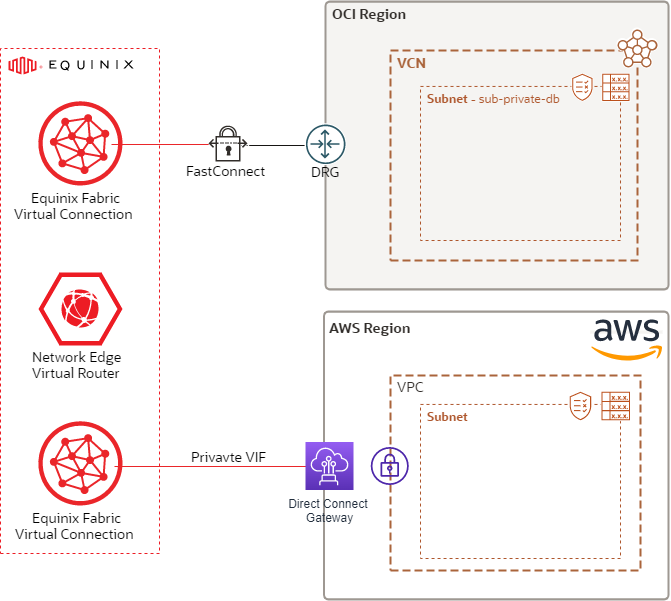

<!-- BEGIN_TF_DOCS -->
# Multicloud connectivity - FastConnect Partner

## Description

This is an example for a private Multicloud connection using OCI FastConnect and a FastConnect Partner.
This scenario will use simple/basic instantiation of the ```terraform-oci-cis-landing-zone-networking``` networking core module.

For detailed description of the ```terraform-oci-cis-landing-zone-networking``` networking core module please refer to the core module specific [README.md](../../README.md) and [SPEC.md](../../SPEC.md).

This example is leveraging the fully dynamic characteristics of the complex networking module input to describe the following networking topology:

- networking construct provisioned on a single compartment
- single networking category defined
- the CIDR range proposed for the secondary Cloud is 172.16.0.0/16
- the category will contain one single VCN (10.0.0.0/18)
- the VCN will contain the following:
    - A security list ```sl-db``` allowing ingress from the db subnet CIDR over TCP(jdbc):1521, ssh:22 and ICMP.
    - A route tables ```rt-02``` with the following routes:
            - route to the DRG for reaching the Secondary Cloud and the Multicloud Router
            - route to the DRG for reaching the Multicloud Router
    - A db subnets:
        - ```db-subnet``` (10.0.1.0/24) for the database tier. This subnet will be using the ```rt-02``` route table, default VCN DHCP options and the db security list.

__NOTE 1:__ Please note that the specific partner configuration will not be mantained in this repo. The specific partner tf file will provide the public path to the code.

__NOTE 2:__ Please note that the entire configuration is a single complex input parameter and you're able to edit it and change the resources names and any of their configuration (like VCN and subnet CIDR blocks, dns labels...) and, also, you're able to change the input configuration topology/structure like adding more categories, more VCNs inside a category, more subnets inside a VCN or inject new resources into existing VCNs and this will reflect into the topology that terraform will provision.

## Diagram of a Multicloud connectivity - FastConnect Partner scenario



## Instantiation

For clarity and proper separation and isolation we've separated the input parameters into 2 files by leveraging terraform ```*.auto.tfvars``` feature:

- [terraform.tfvars](./terraform.tfvars.template)

- [oci_network_configuration.auto.tfvars](./oci_network_configuration.auto.tfvars)


## Output Example:

```
provisioned_fc_vc_id = "ocid1.virtualcircuit.oc1.eu-frankfurt-1.........."
```

This is the ocid of the virtual circuit that must be provided to the connectivity partner
