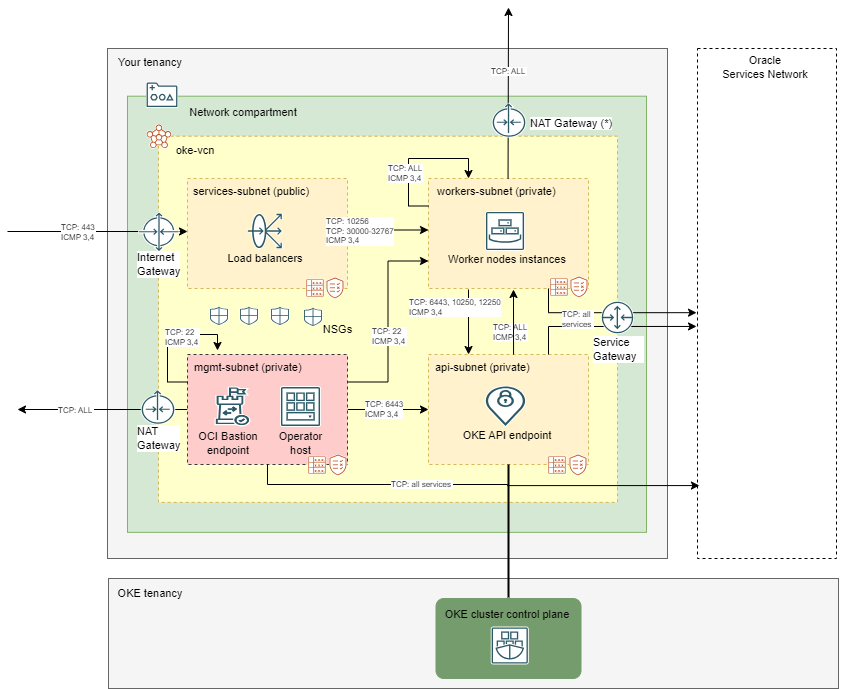

<!-- BEGIN_TF_DOCS -->
# Flannel-based OKE Networking

## Introduction

This is an example of a network topology to host an OKE cluster that utilizes Flannel CNI, private API endpoint, private worker nodes and public load balancers. It is deployed via the [terraform-oci-cis-landing-zone-networking module](https://github.com/oracle-quickstart/terraform-oci-cis-landing-zone-networking). 

The network configuration assumes cluster access occurs from an OKE client that is either external to the tenancy (as a user laptop) or a Compute instance in the VCN *mgmt-subnet*. In both cases, access to OKE API endpoint and worker nodes is enabled by the OCI Bastion service. Providing an access path via a jump host in a public subnet is also an option, however such topology is not in the scope of this example. 



[Click here](./diagrams/oke-flannel-network.drawio.svg) to download the SVG version.

The diagram shows the network topology that is created. The subnets in orange color are required by a Flannel-based deployment. The one in red (*mgmt-subnet*) is an add-on, used as an access path into the OKE cluster for management purposes. The communication patterns are enabled by route tables, security lists and NSGs (Network Security Groups). 

The design favors NSGs for a more fine grained control, however, **SECURITY LISTS ARE USED FOR GENERIC ICMP INGRESS RULES AND FOR BASTION SERVICE SUPPORT, AS BASTION SERVICE DOES NOT SUPPORT NSGs**. Everything else is expressed in NSG rules.

(\*) For a cleaner drawing, the diagram shows two NAT gateways. Only one NAT gateway is actually deployed.

This topology is discussed in the [OCI documentation](https://docs.oracle.com/en-us/iaas/Content/ContEng/Concepts/contengnetworkconfigexample.htm#example-flannel-cni-privatek8sapi_privateworkers_publiclb).

Examples of OKE configurations that deploy in this network topology:
- [Flannel Basic No Access Automation](https://github.com/oracle-quickstart/terraform-oci-secure-workloads/tree/main/cis-oke/examples/flannel/basic): a Flannel-based OKE cluster with no cluster access automation.
- [Flannel Basic with Access from localhost](https://github.com/oracle-quickstart/terraform-oci-secure-workloads/tree/main/cis-oke/examples/flannel/basic-access-from-localhost/): a Flannel-based OKE cluster with access automation via the OCI Bastion service. The OKE client is external to the tenancy (as a user laptop).
- [Flannel Basic with Access from Operator host](https://github.com/oracle-quickstart/terraform-oci-secure-workloads/tree/main/cis-oke/examples/flannel/basic-access-from-operator-host): a Flannel-based OKE cluster with access automation via the OCI Bastion service. The OKE client is a Compute instance in the VCN *mgmt-subnet*.

### Resources Deployed by this Example

The following resources are deployed by this example:

- Single VCN in the compartment referred by *default_compartment_id* attribute, containing the following:
    - Four subnets:
        - **api-subnet** (10.0.0.0/30) for the OKE API endpoint. This subnet utilizes the *api-routetable* route table, default VCN DHCP options and the *api-seclist* security list.
        - **workers-subnet** (10.0.1.0/24) for the application tier. This subnet utilizes the *workers-routetable* route table, default VCN DHCP options and the *workers-seclist* security list.
        - **services-subnet** (10.0.2.0/24) for the load balancers. This subnet utilizes the *services-routetable* route table, default VCN DHCP options and the *services-seclist* security list.
        - **mgmt-subnet** (10.0.3.0/28) for OCI Bastion service endpoint and/or operator host. This subnet utilizes the *mgmt-routetable* route table, default VCN DHCP options and the *mgmt-seclist* security list. This subnet is utilized as an access path from OKE clients to OKE API private endpoint and private worker nodes for management purposes.
    Four route tables:
        - **services-routetable**: defines a route to Internet Gateway.
        - **api-routetable**: defines a route to Service Gateway.
        - **workers-routetable**: defines two routes:
            - a route to NAT Gateway.
            - a route to Service Gateway.   
        - **mgmt-routetable**: defines a route to Service Gateway.   
    - Four security lists:
        - **api-seclist**: for the *api-subnet*, allowing ingress for ICMP (Path Discovery).
        - **workers-seclist**: for the *workers-subnet*, allowing ingress for ICMP (Path Discovery).
        - **services-seclist**: for the *services-subnet*, allowing ingress for ICMP (Path Discovery).
        - **mgmt-seclist**: for the *mgmt-subnet*, with the following rules:
            - *ingress* rule for ICMP (Path Discovery);
            - *ingress* rule from *mgmt-subnet* itself (for Bastion service endpoint to Operator host communication);
            - *egress* rule to *api-subnet* (for Bastion service endpoint to *api-subnet*) 
            - *egress* rule to *mgmt-subnet* itself (For Bastion service endpoint to Operator host communication);
            - *egress* rule to *workers-subnet* (for Bastion service endpoint to *workers-subnet*);
    - Four Network Security Groups (NSGs): **api-nsg**, **workers-nsg**, **services-nsg** and **mgmt-nsg**, containing security rules that enable a more fine-grained control for resources communication.    
    - Three gateways:
        - One Internet Gateway.
        - One NAT Gateway. (\*) For a cleaner drawing, the diagram shows two NAT gateways. Only one NAT gateway is actually deployed.
        - One Service Gateway.

See [input.auto.tfvars.template](./input.auto.tfvars.template) for the variables configuration.

## Using this example
1. Rename *input.auto.tfvars.template* to *\<project-name\>.auto.tfvars*, where *\<project-name\>* is any name of your choice.

2. Within *\<project-name\>.auto.tfvars*, provide tenancy connectivity information and adjust the input variables, by making the appropriate substitutions:
   - Replace \<REPLACE-BY-\*\> placeholder with appropriate value. 
   
Refer to [Networking module README.md](https://github.com/oracle-quickstart/terraform-oci-cis-landing-zone-networking/blob/main/README.md) for overall attributes usage.

3. In this folder, run the typical Terraform workflow:
```
terraform init
terraform plan -out plan.out
terraform apply plan.out
```


