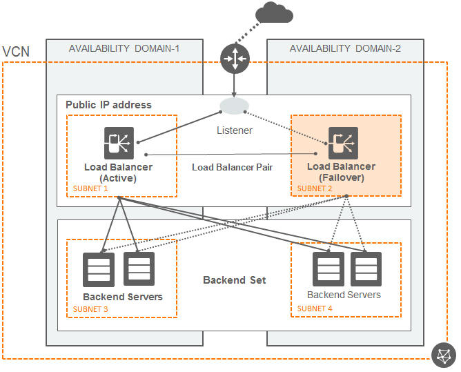

<!-- BEGIN_TF_DOCS -->
# OCI Landing Zone OCI Native Application(L7) Load Balancer(LBaaS) Module


The ```terraform-oci-landing-zones-l7-lbaas``` module is a Terraform layer 7 application load balancer core module that facilitates, in an optional fashion, the provisioning of a CIS compliant set of l7 application load balancers topology for the entire topology or for specific areas of the topology.

It aims to facilitate the provisioning of any OCI l7 lbaas topology.

Check [module specification](./SPEC.md) for a full description of module requirements, supported variables, managed resources and outputs.


This module uses Terraform complex types and optional attributes, in order to create a new abstraction layer on top of Terraform. 
This abstraction layer allows the specification of any l7 lbaas topology containing any number of lbaas resources like listeners, hostnames, certificates and others and mapping those on any existing compartments topology.

The abstraction layer format can be HCL (```*.tfvars``` or ```*.auto.tfvars```) or JSON (```*.tfvars.json``` or ```*.auto.tfvars.json```).

This approach represents an excellent tool for templating. The templating will be made outside of the code, in the configurations files themselves. The ```*.tfvars.*``` can be used as sharable templates that define different and complex topologies.

The main advantage of this approach is that there will be one single code repository for any l7 lbaas configuration. Creation of a new l7 lbaas configuration will not have any impact on the Terraform code, it will just impact the configuration files (```*.tfvars.*``` files).

The separation of code and configuration supports DevOps key concepts for operations design, change management, pipelines.



## CIS OCI Foundations Benchmark Modules Collection

This repository is part of a broader collection of repositories containing modules that help customers align their OCI implementations with the CIS OCI Foundations Benchmark recommendations:
<br />

- [Identity & Access Management ](https://github.com/oracle-oci-landing-zones/terraform-oci-landing-zones-iam)
- [Networking](https://github.com/oracle-quickstart/terraform-oci-cis-landing-zone-networking) - current repository
- [Governance](https://github.com/oracle-oci-landing-zones/terraform-oci-landing-zones-governance)
- Security (coming soon)
- [Observability & Monitoring](https://github.com/oracle-oci-landing-zones/terraform-oci-landing-zones-observability)


The modules in this collection are designed for flexibility, are straightforward to use, and enforce CIS OCI Foundations Benchmark recommendations when possible.
<br />

Using these modules does not require a user extensive knowledge of Terraform or OCI resource types usage. Users declare a JSON object describing the OCI resources according to each module’s specification and minimal Terraform code to invoke the modules. The modules generate outputs that can be consumed by other modules as inputs, allowing for the creation of independently managed operational stacks to automate your entire OCI infrastructure.
<br />

## Requirements

### Terraform Version >= 1.3.0

This module requires Terraform binary version 1.3.0 or greater, as it relies on Optional Object Type Attributes feature. The feature shortens the amount of input values in complex of having Terraform automatically inserting a default value for any missing optional attributes.


### IAM Permissions

This module requires the following OCI IAM permissions:
```
Allow group <group-name> to manage load-balancers in compartment <compartment-name>

```

## How to Invoke the Module

Terraform modules can be invoked locally or remotely. 

For invoking the module locally, just set the module *source* attribute to the module file path (relative path works). The following example assumes the module is two folders up in the file system.
```
module "l7_load_balancers" {
  source = "./modules/l7_load_balancers"
  l7_load_balancers_configuration = {
    dependencies = {
      public_ips              = local.provisioned_oci_core_public_ips
      subnets                 = local.provisioned_subnets
      network_security_groups = local.provisioned_network_security_groups
    },
    l7_load_balancers = local.one_dimension_processed_l7_load_balancers
  }
}
```

For invoking the module remotely, set the module *source* attribute to the networking module repository, as shown:
```
module "l7_load_balancers" {
  source = "git@github.com:oracle-quickstart/terraform-oci-cis-landing-zone-networking.git/modules/l7_load_balancers"
  l7_load_balancers_configuration = {
    dependencies = {
      public_ips              = local.provisioned_oci_core_public_ips
      subnets                 = local.provisioned_subnets
      network_security_groups = local.provisioned_network_security_groups
    },
    l7_load_balancers = local.one_dimension_processed_l7_load_balancers
  }
}
```
For referring to a specific module version, append *ref=\<version\>* to the *source* attribute value, as in:
```
  source = "git@github.com:oracle-quickstart/terraform-oci-cis-landing-zone-networking.git?ref=v0.1.0/modules/l7_load_balancers"
```

## How to use the module

The input parameters for the module can be divided into two categories, for which we recomend to create two different ```*.tfvars.*``` files:
 1. OCI REST API authentication information (secrets) - ```terraform.tfvars``` (HCL) or ```terraform.tfvars.json``` (JSON):
    - ```tenancy_ocid```
    - ```user_ocid```
    - ```fingerprint```
    - ```private_key_path```
    - ```region```

 2. L7 LBaaS configuration single complex type: ```lbaas_configuration.auto.tfvars``` (HLC) or ```lbaas_configuration.auto.tfvars.json```:
   
```l7_load_balancers_configuration```:

  The ```l7_load_balancers_configuration``` complex type can accept any new l7 lbaas topology that can map on any compartments topology.

  The ```l7_load_balancers_configuration``` complex type fully supports optional attributes as long as they do not break any dependency imposed by OCI.

- ```dependencies``` attribute is a complex attribute that has the role of providing key-value pairs for the OCI objects that the LBaaS might depend on. This will offer the option to be able to refer to those dependencies not only by OCIDs but also by KEY and thus, facilitating integrationg this with other modules that will be required to pass to the dependencies the outputs of creating the potentials dependenicies like:
   - ```subnets```
   - ```public_ips```
   - ```network_security_groups```

- ```l7_load_balancers``` is a multidimensional attribute that:
  - ```compartment_id``` holds the compartment id that will be used 
  - ```display_name``` load balancer displayed name
  - ```shape``` LBaaS shape
  - ```subnet_ids``` and ```subnet_keys``` the ocids of the subnets that will be used by the LBaaS. If the ```subnet_ids``` are empty than the automation will try to search the subnets by the provided ```subnet_keys```.
  - ```defined_tags``` LBaaS defined tags
  - ```freeform_tags``` LBaaS freeform tags
  - All the OCI LBaaS resource attributes are supported by this configuration: ```ip_mode```, ```is_private```, ```network_security_group_ids/network_security_group_keys```, ```reserved_ips_ids/reserved_ips_keys``` and ```shape_details```. Please refer to the OCI LBaaS documentation that is covering all the upper mentioned resource attributes.
  - ```backend_sets``` represents an optional attribute that allows the definition of zero, one or multiple backend sets that will be associated with the current load balancer. All the OCI ```backend_set attributes``` are covered: ```health_checker```, ```name```, ```policy```, ```lb_cookie_session_persistence_configuration```, ```session_persistence_configuration```, ```ssl_configuration``` and ```backends```. Please refer to the OCI LBaaS documentation that is covering all the upper mentioned resource attributes.
  - ```path_route_sets``` represents an optional attribute that allows the definition of zero, one or multiple path route sets that will be associated with the current load balancer. All the OCI ```path_route_sets``` attributes are covered: ```name```, ```path_routes```. Please refer to the OCI LBaaS documentation that is covering all the upper mentioned resource attributes.
  - ```host_names``` represents an optional attribute that allows the definition of zero, one or multiple host names that will be associated with the current load balancer. All the OCI ```host_names``` attributes are covered: ```hostname``` and ```name```. Please refer to the OCI LBaaS documentation that is covering all the upper mentioned resource attributes.
  - ```routing_policies``` represents an optional attribute that allows the definition of zero, one or multiple routing policies that will be associated with the current load balancer. All the OCI ```routing_policies``` attributes are covered: ```condition_language_version```, ```name```,  and ```condition```. Please refer to the OCI LBaaS documentation that is covering all the upper mentioned resource attributes.
  - ```rule_sets``` represents an optional attribute that allows the definition of zero, one or multiple rules sets that will be associated with the current load balancer. All the OCI ```rule_sets``` attributes are covered: ```name``` and ```items```. Please refer to the OCI LBaaS documentation that is covering all the upper mentioned resource attributes.
  - ```certificates``` represents an optional attribute that allows the definition of zero, one or multiple certificates that will be associated with the current load balancer. All the OCI ```certificates``` attributes are covered: ```certificate_name```, ```ca_certificate```, ```passphrase```, ```private_key``` and ```public_certificate```. Please refer to the OCI LBaaS documentation that is covering all the upper mentioned resource attributes.
  - ```listeners``` represents an optional attribute that allows the definition of zero, one or multiple listeners that will be associated with the current load balancer. All the OCI ```listeners``` attributes are covered: ```default_backend_set_key```, ```name```, ```port```, ```protocol```, ```connection_configuration```, ```hostname_keys```, ```path_route_set_key```, ```routing_policy_key```, ```rule_set_keys``` and ```ssl_configuration```. Please refer to the OCI LBaaS documentation that is covering all the upper mentioned resource attributes.
 
__NOTE_1:__ To refer to a resource created by this automation the resource key should be used.
  

__NOTE_2:__ *It is strongly recommended* not *to change a resource key after the first provisioning. Once a key has been defined and applied the configuration, changing the key will result in  resource re-creation. As the key does not play any role in the configuration that will be pushed to OCI, it will have no impact on the deployment. To distinguish keys from resource names it is recommended to use this convention (using capital characters): ```{RESOURCE_NAME}-KEY```.*


This module can be used directly by copying one of the provided [examples](examples/) and modify to match the use-case.

It can also be integrated with other core modules into an orchestrated solution. It might be needed to apply some customizations to the complex type. Some examples of orchestrating this module into a more comprehensive solution can be found here:
  - [Provision a load balancer on top of an existing VCN](../../examples/simple-no_vcn-oci-native-l7-lbaas-example)
  - [Provision a complete VCN and a load balancer](../../examples/standard-vcn-oci-native-l7-lbaas-example)


<a name="howtoexample"></a>
### Examples

- [Simple Example](examples/simple-lbaas-on-existing-vcn/)

## Related Documentation
- [OCI Application Load Balancer Overview](https://docs.oracle.com/en-us/iaas/Content/Balance/home.htm)

## Known Issues

