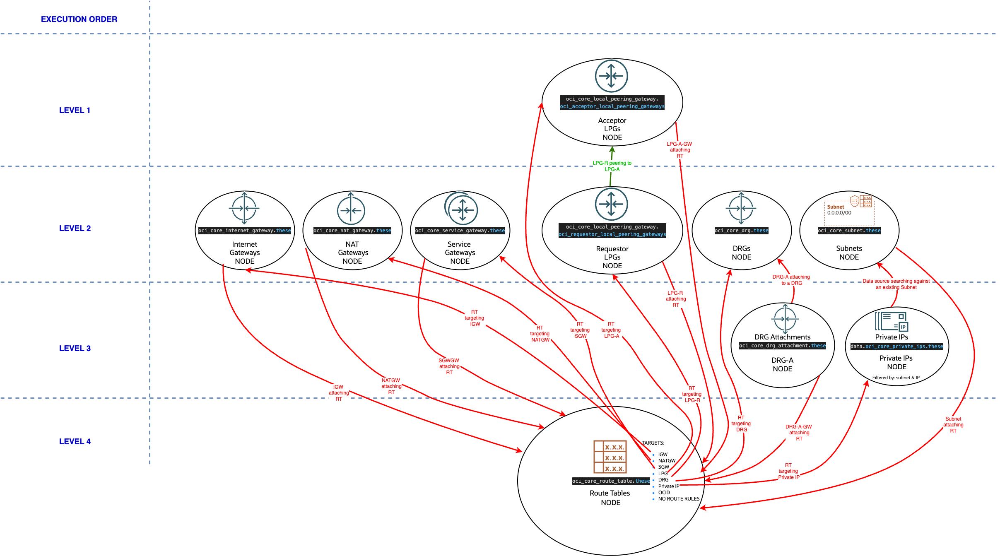
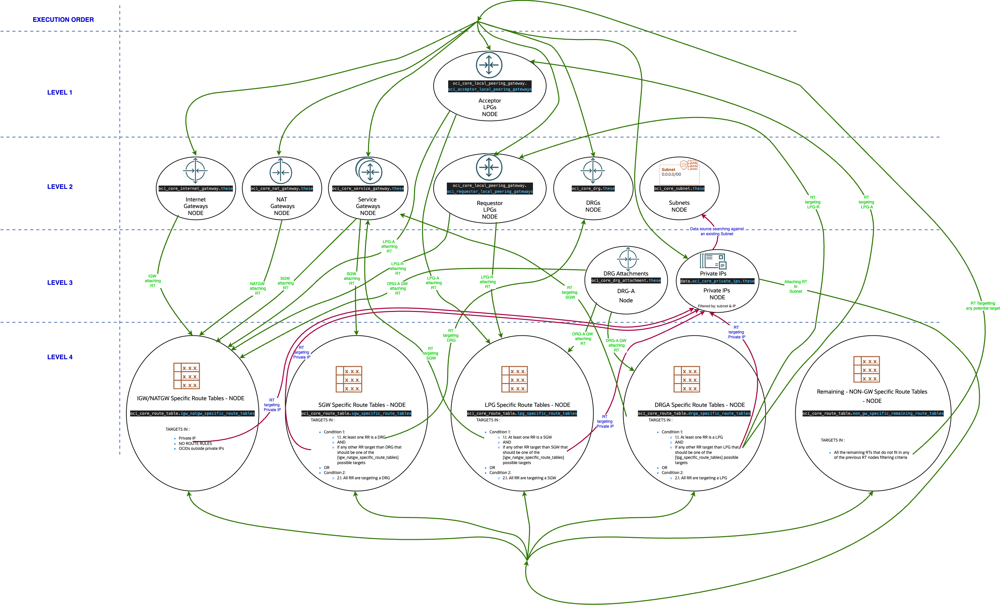

# Route Tables TF Dependency Graph Cycles - Description of the algorithm addressing the cycles

## 1. Problem Description

  - When creating all defined route tables under a single ```"oci_core_route_table" ```resources, practically we'll get one single node in the TF graph - let's name this ```RTS-Node``` 
  - Route Tables can be attached to the following elemets: ``IGW``, ``NAT-GW``, ``SGW``, ``DRG``, ``LPG`` and ``SUBNET``. We'll be creating those under different resources getting 6 different nodes in the graph named as follows:
    ```IGWS-Node```,``` NATGWS-Node```, ```SGWS-Node```, ```DRGS-Node```, ``LPGS-Node``, ```SUBNETS-Node```
  - But the route table route rules have the option to target the 6 nodes described above, ***creating the possibility for cycles in the graph***.
  - Terraform first builds the graph and with all the potential options - calling that ```POTENTIAL GRAPH```.
  - After ```POTENTIAL GRAPH``` is build, the actual desired configuration is evaluated.
  - ```POTENTIAL GRAPH``` is checked for cycles. Cycles are not supported in the ```POTENTIAL GRAPH``` and they are erorred out at terraform plan - as ***cycle graph errors***.
  - One route table can be attached to multiple elements - the solution should not duplicate route tables.

  

## 2. Solution

  - In the same way as terraform graph do not support cycles, in networking, cycles or loops are not supported as well - and if one tries to configure those in OCI, OCI will catch and report them as errors.
  - To solve our problem described above we need not to rely anymore on OCI to catch those routing cycles/loops. We need to implement those checks in terraform.
  - The main impact of implementing those checks will be:
       - we'll split the single ```RTS-Node``` into different nodes(5) and each of those nodes will NOT be in a cycle graph relation(referencing one another) with any of the 6 RT attachable entities nodes:
         ```IGWS-Node```, ```NATGWS-Node```, ```SGWS-Node```, ```DRGS-Node```, ```LPGS-Node```, ```SUBNETS-Node```
       - The split criteria will follow the exact logic of OCI components without adding any limitations in OCI route rules configuration and functionality

  

### 2.1. Describing the RTS-Node splitting in 5 nodes:

- RT-NODE-1-IGW-NATGW-Atachable-RTs:
    - This will contain all the RTs that are attachable to IGWs or NATGWs
    - The route rules of these route tables will only be able to target: private_ips, OCIDs(outside private IPs) or no route rules in the route table.
- RT-NODE-2-SGW-Atachable-RTs:
    - This will contain not *all but specific RTs that are attachable to SGWs - specific SGWs route tables
    - The route rules of these route tables will only be able to target: 
        - just DRGS 
          - OR
        - DRGS AND any of the available targets for NODE 1 - IGW-NATGW-Atachable-RTs
- RT-NODE-3-LPG-Atachable-RTs:
    - This will contain not *all but specific RTs that are attachable to LPGs - specific LPGs route tables
    - The route rules of these route tables will only be able to target: 
        - just SGWS 
            - OR
        - SGWS AND any of the available targets for NODE 1 - IGW-NATGW-Atachable-RTs
- RT-NODE-4-DRGA-Atachable-RTs:
    - This will contain not all* but specific RTs that are attachable to LPGs specific LPGs route tables
    - The route rules of these route tables will only be able to target: 
        - just LPGS 
            - OR
        - LPGS AND any of the available targets for NODE 3 - LPG-Atachable-RTs:
- RT-NODE-5-REMAINING-RTS: The remaining RTs that do not fit into the criteria for NODES 1-4.
    - These will only be attachable to SUBNETS

### 2.2. Describing the relation in between 6 RT attachable entities nodes and the the 5 RTS-Node splitted nodes:

-  6 RT attachable entities nodes
    - AT-NODE-1-IGWS and AT-NODE-1-NATGW
        - can refer: RT-NODE-1-IGW-NATGW-Atachable-RTs route tables
        - can be reffered by: RT-NODE-5-REMAINING-RTS route rules
    - AT-NODE-2-SGW:
        - can refer: RT-NODE-1-IGW-NATGW-Atachable-RTs and RT-NODE-2-SGW-Atachable-RTs route tables
        - can be reffered by: RT-NODE-2-LPG-Atachable-RTs and RT-NODE-2-DRGA-Atachable-RTs route rules
    - AT-NODE-3-LPG:
        - can refer: RT-NODE-1-IGW-NATGW-Atachable-RTs and RT-NODE-2-LPG-Atachable-RTs route tables
        - can be reffered by:  RT-NODE-4-DRGA-Atachable-RTs route rules
    - AT-NODE-4-DRGA:
        - can refer: RT-NODE-1-IGW-NATGW-Atachable-RTs, RT-NODE-2-LPG-Atachable-RTs and RT-NODE-2-DRGA-Atachable-RTs route tables
        - can be reffered by:  RT-NODE-4-SGW-Atachable-RTs route rules
    - AT-NODE-5-SUBNET:
        - can refer: RT-NODE-1-IGW-NATGW-Atachable-RTs, RT-NODE-2-LPG-Atachable-RTs, RT-NODE-2-SGW-Atachable-RTs, RT-NODE-5-REMAINING-RTS and RT-NODE-2-DRGA-Atachable-RTs route tables
        - can be reffered by:  NONE

- Notice that there is no loop/cycle in between the nodes described above and, in the same time, no limitation in the OCI functionality

## 3. Limitations

### 3.1. Changing Route Table Node
Once a route table update will generate a switch from one RT-NODE to another one, and the initial node is referenced by an AT-NODE, this will generate an error as terraform will
attempt to delete the RT from the current node and recreated as part of a different node without updating the AT-NODE(referencing node)
  - The workaround will be to 1st delete manualy the refereance from the *tfvars/json/yaml configuration, run terraform apply and them update and apply the RT with an update that will generate
a move from one RT-NODE to another one.
  - This limitation will also, as said, generate a recreation of the object and not just an update of the RT object.

### 3.2. Route Tables targeting Private IPs

Route tables that contain route rules that target private IPs need, for now, to specify the OCIDs for those IPs under network entity IDs. Creating RTs with route rules targeting private IPs will
require multiple terraform applies. It is not possible to address this limitation without hitting cycle graphs.


## 4. TO DOs

### 4.1. Add the above functionality for default_route_tables